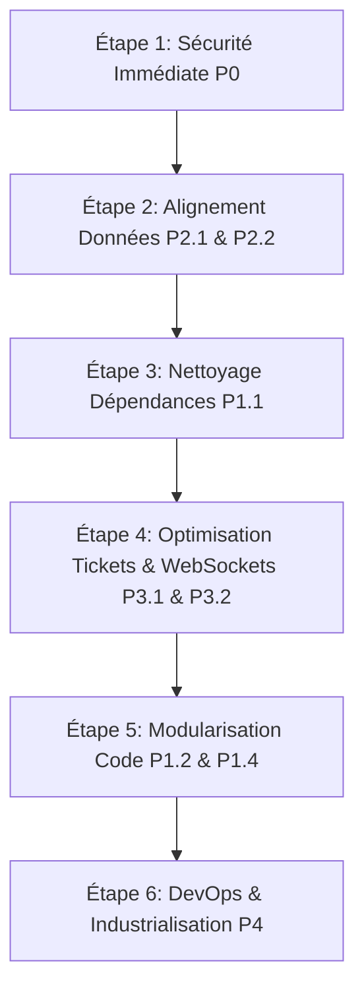

# 📋 PLAN COMPLET DES CORRECTIONS (P0 À P4) - COFINA QUEUE MANAGEMENT
> **Document de Référence Technique & Guide d'Implémentation**  
> **Projet** : Cofina Edge Queue Deployment (Agence Siège Lomé Togo & Siège Central)  
> **Emplacement** : Racine du projet (`CORRECTIONS.md`)  
> **Date de rédaction** : Septembre 2026

---

## 📑 TABLE DES MATIÈRES
1. [Matrice Synthétique des Priorités (P0 à P4)](#1-matrice-synthétique-des-priorités-p0-à-p4)
2. [P0 — SÉCURITÉ CRITIQUE & VULNÉRABILITÉS](#2-p0--sécurité-critique--vulnérabilités-blocage-immédiat)
   - [P0.1 : Mots de passe et secrets en dur dans le frontend (`queueStore.js`)](#p01--mots-de-passe-et-secrets-en-dur-dans-le-frontend-srcservicesqueuestorejs)
   - [P0.2 : Secrets JWT et mots de passe par défaut dans le backend (`auth.ts`)](#p02--secrets-jwt-et-mots-de-passe-par-défaut-dans-le-backend-serversrcauthts)
   - [P0.3 : CORS permissif et absence de headers de sécurité (`server.ts`)](#p03--cors-permissif-et-absence-de-headers-de-sécurité-serversrcserverts)
   - [P0.4 : Absence de Rate Limiting anti-bruteforce / DoS (`server.ts`)](#p04--absence-de-rate-limiting-anti-bruteforce--dos-serversrcserverts)
   - [P0.5 : Validation des données entrantes avec Zod](#p05--validation-des-données-entrantes-avec-zod)
   - [P0.6 : Mot de passe Postgres et Token de sync en clair (`docker-compose.yml`, `syncWorker.ts`)](#p06--mot-de-passe-postgres-et-token-de-sync-en-clair-docker-composeyml-serversrcsyncworkerts)
3. [P1 — ARCHITECTURE & DETTE TECHNIQUE MAJEURE](#3-p1--architecture--dette-technique-majeure)
   - [P1.1 : Démêlage et assainissement des `package.json` (Racine vs Server)](#p11--démêlage-et-assainissement-des-packagejson-racine-vs-server)
   - [P1.2 : Modularisation du serveur Express monolithique (`server.ts`)](#p12--modularisation-du-serveur-express-monolithique-serversrcserverts)
   - [P1.3 : Suppression du doublon d'endpoint `/health`](#p13--suppression-du-doublon-dendpoint-health)
   - [P1.4 : Découpage du God Object Frontend (`queueStore.js`)](#p14--découpage-du-god-object-frontend-srcservicesqueuestorejs)
4. [P2 — FIABILITÉ, DONNÉES & COHÉRENCE MÉTIER](#4-p2--fiabilité-données--cohérence-métier)
   - [P2.1 : Harmonisation des codes de service (Frontend <-> Backend)](#p21--harmonisation-des-codes-de-service-frontend---backend)
   - [P2.2 : Sauvegarde SQLite atomique sans risque de corruption (`backupService.ts`)](#p22--sauvegarde-sqlite-atomique-sans-risque-de-corruption-serversrcbackupservicets)
   - [P2.3 : Pagination et filtres sur les requêtes lourdes](#p23--pagination-et-filtres-sur-les-requêtes-lourdes)
   - [P2.4 : Nettoyage de la base `dev.db` suivie à tort par Git](#p24--nettoyage-de-la-base-devdb-suivie-à-tort-par-git)
5. [P3 — PERFORMANCE & EXPÉRIENCE UTILISATEUR](#5-p3--performance--expérience-utilisateur)
   - [P3.1 : Optimisation de la génération de séquence des tickets (O(1) vs O(N))](#p31--optimisation-de-la-génération-de-séquence-des-tickets-o1-vs-on)
   - [P3.2 : Allègement du payload WebSocket (Delta events vs dump hebdomadaire)](#p32--allègement-du-payload-websocket-delta-events-vs-dump-hebdomadaire)
   - [P3.3 : Code-splitting React & Lazy Loading des modules lourds (`App.jsx`)](#p33--code-splitting-react--lazy-loading-des-modules-lourds-srcappjsx)
6. [P4 — DEVOPS, TESTS & INDUSTRIALISATION](#6-p4--devops-tests--industrialisation)
   - [P4.1 : Fichiers `.env.example` documentés](#p41--fichiers-envexample-documentés)
   - [P4.2 : Remplacement de `vite preview` par un serveur de production statique (`ecosystem.config.cjs`)](#p42--remplacement-de-vite-preview-par-un-serveur-de-production-statique-ecosystemconfigcjs)
   - [P4.3 : Dockerfile multi-stage pour la production](#p43--dockerfile-multi-stage-pour-la-production)
   - [P4.4 : Suite de tests d'intégration automatisés](#p44--suite-de-tests-dintégration-automatisés)
7. [Ordre d'Exécution Recommandé](#7-ordre-dexécution-recommandé)

---

## 1. Matrice Synthétique des Priorités (P0 à P4)

| Niveau | Domaine | Problème principal | Impact métier / technique | Effort |
| :--- | :--- | :--- | :--- | :--- |
| **P0** | Sécurité | Mots de passe & JWT secrets en dur (client + serveur) | Élévation de privilèges, compromission totale | Faible (1j) |
| **P0** | Sécurité | Absence de validation des inputs (injections potentielles) | Corruption base SQLite, plantage serveur | Moyen (1j) |
| **P0** | Sécurité | CORS `*` + absence de Rate Limit | Attaques DoS, bruteforce des codes PIN | Faible (0.5j) |
| **P1** | Architecture | Monolithe `server.ts` (584 lignes) & `queueStore.js` (857 lignes) | Dette technique, régression sur maintenance | Moyen (2j) |
| **P1** | Architecture | Dépendances backend polluant le `package.json` racine | Risque d'incohérence runtime, builds corrompus | Faible (0.5j) |
| **P2** | Données | 12 services côté UI vs 8 attendus côté serveur | Tickets invisibles ou erreurs de compteurs | Faible (0.5j) |
| **P2** | Données | Sauvegarde SQLite via `fs.copyFileSync` (non-atomique) | Backups corrompus si écriture concurrente WAL | Faible (0.5j) |
| **P3** | Performance | Ticket sequence check charge tous les tickets en mémoire | Lenteur exponentielle au fil de la semaine | Moyen (1j) |
| **P3** | Performance | WebSockets émettent tous les tickets de la semaine à chaque clic | Saturation de la bande passante LAN agence | Moyen (1j) |
| **P4** | DevOps | `vite preview` en production dans PM2 au lieu de Nginx | Fuite mémoire, serveur de démo instable | Faible (0.5j) |
| **P4** | DevOps | Manque de `.env.example`, Dockerfiles prod et tests e2e | Risque d'erreur humaine lors des déploiements | Moyen (1j) |

---

## 2. P0 — SÉCURITÉ CRITIQUE & VULNÉRABILITÉS (Blocage Immédiat)

### P0.1 : Mots de passe et secrets en dur dans le frontend (`src/services/queueStore.js`)

#### 🔴 Le Problème
Dans `src/services/queueStore.js`, les lignes 335 et 396 contiennent des mots de passe en clair :
- Ligne 335 : `password: 'cofina2026'` (auto-login agent silencieux).
- Ligne 396 : `loginAsAdmin('cofinaAdmin2026!')` (si aucun token admin n'est présent, le client se connecte automatiquement en Administrateur !).
N'importe quel utilisateur ou client ouvrant les Outils Développeur (`F12`) peut lire ces identifiants et prendre le contrôle total du système.

#### 🟢 Correction à appliquer

Dans `src/services/queueStore.js` :
Supprimer l'auto-login avec mot de passe par défaut. Forcer l'authentification par l'interface utilisateur.

```diff
--- a/src/services/queueStore.js
+++ b/src/services/queueStore.js
@@ -327,24 +327,11 @@ export const getAuthToken = async (forceRefresh = false) => {
   if (typeof window !== 'undefined') {
     token = localStorage.getItem('cofina_jwt_token');
   }
-  if (!token) {
-    try {
-      const res = await fetch(`${SERVER_URL}/api/auth/login`, {
-        method: 'POST',
-        headers: { 'Content-Type': 'application/json' },
-        body: JSON.stringify({ username: 'agent', password: 'cofina2026' })
-      });
-      if (res.ok) {
-        const data = await res.json();
-        token = data.token;
-        if (typeof window !== 'undefined') {
-          localStorage.setItem('cofina_jwt_token', token);
-        }
-      }
-    } catch (e) {
-      console.error('Auto login failed:', e);
-    }
-  }
+  // Sécurité P0 : Plus d'authentification automatique avec mot de passe hardcodé.
+  // Si pas de token, l'utilisateur doit être redirigé vers l'écran de login.
+  if (!token) {
+    return null;
+  }
   return token;
 };
@@ -390,13 +377,7 @@ export const logoutAdmin = () => {
 export const getAdminAuthHeaders = async () => {
   let token = getAdminToken();
   if (!token) {
-    // Si pas de token admin stocké, on tente le login admin par défaut
-    try {
-      const loginRes = await loginAsAdmin('cofinaAdmin2026!');
-      token = loginRes.token;
-    } catch (_) {}
+    throw new Error('Session administrateur expirée ou non authentifiée');
   }
   return {
     'Content-Type': 'application/json',
```

---

### P0.2 : Secrets JWT et mots de passe par défaut dans le backend (`server/src/auth.ts`)

#### 🔴 Le Problème
Dans `server/src/auth.ts` :
```typescript
export const JWT_SECRET = process.env.JWT_SECRET || 'cofina_edge_togo_secret_key_2026';
export const ADMIN_PASSWORD = process.env.ADMIN_PASSWORD || 'cofinaAdmin2026!';
export const AGENT_PASSWORD = process.env.AGENT_PASSWORD || 'cofina2026';
```
Si les variables d'environnement ne sont pas définies en production, l'application utilise des clés publiques triviales.

#### 🟢 Correction à appliquer

Modifier `server/src/auth.ts` pour exiger explicitement la présence de ces variables en production :

```typescript
// server/src/auth.ts
import jwt from 'jsonwebtoken';
import bcrypt from 'bcryptjs';

const isProduction = process.env.NODE_ENV === 'production';

if (isProduction && !process.env.JWT_SECRET) {
  throw new Error('FATAL: La variable d\'environnement JWT_SECRET est obligatoire en production.');
}
if (isProduction && (!process.env.ADMIN_PASSWORD || !process.env.AGENT_PASSWORD)) {
  throw new Error('FATAL: ADMIN_PASSWORD et AGENT_PASSWORD doivent être configurés dans le fichier .env.');
}

export const JWT_SECRET = process.env.JWT_SECRET || 'dev_only_jwt_secret_must_change_in_prod';
export const ADMIN_PASSWORD = process.env.ADMIN_PASSWORD || 'cofinaAdmin2026!';
export const AGENT_PASSWORD = process.env.AGENT_PASSWORD || 'cofina2026';
```

---

### P0.3 : CORS permissif et absence de headers de sécurité (`server/src/server.ts`)

#### 🔴 Le Problème
Dans `server/src/server.ts` :
```typescript
const io = new Server(httpServer, {
  cors: { origin: '*', methods: ['GET', 'POST', 'PUT', 'DELETE'] }
});
app.use(cors());
```
N'importe quel site web malveillant ouvert dans le navigateur d'un poste agent peut faire des requêtes vers l'API locale de l'agence.

#### 🟢 Correction à appliquer

Installer `helmet` et restreindre le CORS aux origines autorisées (ex: l'IP de l'agence et `localhost`) :

```typescript
// À ajouter dans server/src/server.ts
import helmet from 'helmet';

// Protection des headers HTTP
app.use(helmet({
  crossOriginResourcePolicy: { policy: "cross-origin" }
}));

const allowedOrigins = process.env.ALLOWED_ORIGINS 
  ? process.env.ALLOWED_ORIGINS.split(',') 
  : ['http://localhost:3000', 'http://127.0.0.1:3000'];

const corsOptions: cors.CorsOptions = {
  origin: (origin, callback) => {
    // Permet les requêtes locales sans header origin (outils internes, curl)
    if (!origin || allowedOrigins.includes(origin) || origin.startsWith('http://192.168.') || origin.startsWith('http://10.')) {
      callback(null, true);
    } else {
      callback(new Error('Bloqué par la politique CORS Cofina'));
    }
  },
  credentials: true,
  methods: ['GET', 'POST', 'PUT', 'DELETE', 'OPTIONS']
};

app.use(cors(corsOptions));
```

---

### P0.4 : Absence de Rate Limiting anti-bruteforce / DoS (`server/src/server.ts`)

#### 🔴 Le Problème
Les routes `/api/auth/login` et `/api/tickets` n'ont aucune limitation de requêtes. Un attaquant ou un script en boucle peut saturer la base SQLite locale ou tenter des milliers de mots de passe par seconde.

#### 🟢 Correction à appliquer

Installer `express-rate-limit` dans `server/` et l'appliquer sur les routes sensibles :

```typescript
// server/src/middlewares/rateLimiter.ts
import rateLimit from 'express-rate-limit';

// Limite pour le login (anti force-brute) : 5 tentatives max par minute par IP
export const authRateLimiter = rateLimit({
  windowMs: 60 * 1000,
  max: 5,
  message: { error: 'Trop de tentatives de connexion. Réessayez dans une minute.' },
  standardHeaders: true,
  legacyHeaders: false,
});

// Limite générale pour l'API : 120 requêtes par minute par IP
export const apiRateLimiter = rateLimit({
  windowMs: 60 * 1000,
  max: 120,
  message: { error: 'Trop de requêtes. Veuillez patienter.' },
  standardHeaders: true,
  legacyHeaders: false,
});

// Limite pour la borne tactile de création de tickets : 15 tickets / minute max par IP
export const ticketCreationLimiter = rateLimit({
  windowMs: 60 * 1000,
  max: 15,
  message: { error: 'Génération de tickets temporairement restreinte. Veuillez patienter.' }
});
```

Application dans `server/src/server.ts` :
```typescript
app.use('/api/', apiRateLimiter);
app.use('/api/auth/login', authRateLimiter);
app.use('/api/tickets', ticketCreationLimiter);
```

---

### P0.5 : Validation des données entrantes avec Zod

#### 🔴 Le Problème
Dans `server.ts`, les champs de `req.body` sont lus sans validation (`const { serviceCode, serviceName, isPriority, customerPhone } = req.body;`). Une valeur `undefined`, une chaîne de 100 000 caractères ou un mauvais type provoque un plantage ou stocke des données corrompues.

#### 🟢 Correction à appliquer

Créer un validateur strict avec `zod` (`server/src/schemas/ticket.schema.ts`) :

```typescript
// server/src/schemas/ticket.schema.ts
import { z } from 'zod';

export const createTicketSchema = z.object({
  serviceCode: z.enum([
    'D', 'R', 'TN', 'TI', 'O', 'RC', 'V', 'DR', 'CM', 'C', 'PC', 'PMR'
  ], {
    errorMap: () => ({ message: 'Code de service invalide' })
  }),
  serviceName: z.string().min(2).max(100),
  isPriority: z.boolean().optional().default(false),
  customerPhone: z.string().regex(/^(\+228)?[0-9]{8}$/, 'Format téléphone Togo invalide (8 chiffres)').nullable().optional(),
  customerEmail: z.string().email('Email invalide').nullable().optional()
});

export const callTicketSchema = z.object({
  ticketId: z.string().uuid('ID ticket invalide'),
  counterNumber: z.number().int().min(1).max(20),
  agentName: z.string().min(2).max(50)
});
```

Middleware générique de validation (`server/src/middlewares/validate.ts`) :
```typescript
import { Request, Response, NextFunction } from 'express';
import { AnyZodObject, ZodError } from 'zod';

export const validate = (schema: AnyZodObject) => 
  async (req: Request, res: Response, next: NextFunction) => {
    try {
      req.body = await schema.parseAsync(req.body);
      next();
    } catch (error) {
      if (error instanceof ZodError) {
        return res.status(400).json({
          status: 'VALIDATION_ERROR',
          errors: error.errors.map(e => ({ field: e.path.join('.'), message: e.message }))
        });
      }
      return res.status(500).json({ error: 'Erreur interne de validation' });
    }
  };
```

---

### P0.6 : Mot de passe Postgres et Token de sync en clair (`docker-compose.yml`, `server/src/syncWorker.ts`)

#### 🔴 Le Problème
- `docker-compose.yml` : ligne 12 `POSTGRES_PASSWORD: CofinaTogo2026!Secure` est stocké en clair dans le dépôt Git.
- `server/src/syncWorker.ts` : ligne 70 `'X-Sync-Token': process.env.SYNC_API_TOKEN || 'cofina_sync_token_default'`.

#### 🟢 Correction à appliquer

1. **Dans `docker-compose.yml`** : Utiliser des variables issues de `.env` :
```yaml
# docker-compose.yml
version: '3.8'

services:
  postgres:
    image: postgres:16-alpine
    container_name: cofina_postgres
    restart: always
    environment:
      POSTGRES_DB: ${POSTGRES_DB:-cofina_queue_db}
      POSTGRES_USER: ${POSTGRES_USER:-cofina_admin}
      POSTGRES_PASSWORD: ${POSTGRES_PASSWORD:?Erreur: POSTGRES_PASSWORD requis dans .env}
    ports:
      - "127.0.0.1:5432:5432" # Ne pas exposer sur 0.0.0.0 sans pare-feu
    volumes:
      - postgres_data:/var/lib/postgresql/data
```

2. **Dans `server/src/syncWorker.ts`** :
```typescript
const syncToken = process.env.SYNC_API_TOKEN;
if (!syncToken && process.env.NODE_ENV === 'production') {
  console.warn('[SyncOutbox Worker] ⚠️ ATTENTION: SYNC_API_TOKEN manquant. Synchronisation suspendue.');
  return;
}
```

---

## 3. P1 — ARCHITECTURE & DETTE TECHNIQUE MAJEURE

### P1.1 : Démêlage et assainissement des `package.json` (Racine vs Server)

#### 🔴 Le Problème
Le fichier racine `package.json` contient des dépendances backend inutiles pour le frontend React (`bcryptjs`, `express`, `jsonwebtoken`, `socket.io`, `tsx`, `typescript: ^7.0.2` inexistante).
À l'inverse, `server/package.json` dépend de `"cofina-queue-v1": "file:.."` créant un lien circulaire vicieux.

#### 🟢 Correction à appliquer

1. **`package.json` racine (Frontend Vite uniquement)** :
```json
{
  "name": "cofina-queue-frontend",
  "private": true,
  "version": "1.0.0",
  "type": "module",
  "scripts": {
    "dev": "vite --host --port 3000",
    "build": "vite build",
    "preview": "vite preview --host --port 3000",
    "test": "vitest run",
    "server:dev": "npm --prefix server run dev",
    "server:build": "npm --prefix server run build",
    "server:start": "npm --prefix server start"
  },
  "dependencies": {
    "canvas-confetti": "^1.9.4",
    "lucide-react": "^0.469.0",
    "qrcode": "^1.5.4",
    "react": "^18.3.1",
    "react-dom": "^18.3.1",
    "socket.io-client": "^4.8.1"
  },
  "devDependencies": {
    "@tailwindcss/postcss": "^4.0.0",
    "@types/react": "^18.3.18",
    "@types/react-dom": "^18.3.5",
    "@vitejs/plugin-react": "^4.3.4",
    "autoprefixer": "^10.4.20",
    "postcss": "^8.4.49",
    "tailwindcss": "^4.0.0",
    "vite": "^6.0.7",
    "vitest": "^2.1.8"
  }
}
```

2. **`server/package.json` (Backend Express/Prisma)** :
```json
{
  "name": "cofina-queue-server",
  "version": "1.0.0",
  "private": true,
  "type": "module",
  "scripts": {
    "dev": "tsx watch src/server.ts",
    "build": "tsc",
    "start": "node dist/server.js",
    "prisma:generate": "prisma generate",
    "prisma:push": "prisma db push"
  },
  "dependencies": {
    "@prisma/client": "^5.22.0",
    "bcryptjs": "^2.4.3",
    "compression": "^1.7.5",
    "cors": "^2.8.5",
    "dotenv": "^16.4.7",
    "express": "^4.21.2",
    "express-rate-limit": "^7.5.0",
    "helmet": "^8.0.0",
    "jsonwebtoken": "^9.0.2",
    "socket.io": "^4.8.1",
    "zod": "^3.24.1"
  },
  "devDependencies": {
    "@types/bcryptjs": "^2.4.6",
    "@types/compression": "^1.7.5",
    "@types/cors": "^2.8.17",
    "@types/express": "^4.17.21",
    "@types/jsonwebtoken": "^9.0.7",
    "@types/node": "^20.17.10",
    "prisma": "^5.22.0",
    "tsx": "^4.19.2",
    "typescript": "^5.7.2"
  }
}
```

---

### P1.2 : Modularisation du serveur Express monolithique (`server.ts`)

#### 🔴 Le Problème
`server/src/server.ts` fait 584 lignes et gère à la fois :
- La configuration HTTP & Socket.io
- La logique métier des tickets et des agences
- Les calculs statistiques et d'analytics
- Les routes d'authentification
- Les endpoints de backup
- Les sockets temps-réel

#### 🟢 Structure cible recommandée
```text
server/src/
├── controllers/
│   ├── auth.controller.ts
│   ├── ticket.controller.ts
│   ├── agency.controller.ts
│   ├── backup.controller.ts
│   └── stats.controller.ts
├── routes/
│   ├── auth.routes.ts
│   ├── ticket.routes.ts
│   ├── agency.routes.ts
│   ├── backup.routes.ts
│   └── stats.routes.ts
├── services/
│   ├── ticket.service.ts
│   ├── queueState.service.ts
│   └── backupService.ts
├── sockets/
│   └── queueSocket.handler.ts
├── middlewares/
│   ├── auth.middleware.ts
│   ├── rateLimiter.ts
│   └── validate.ts
└── server.ts  (< 90 lignes, simple chef d'orchestre)
```

---

### P1.3 : Suppression du doublon d'endpoint `/health`

#### 🔴 Le Problème
Dans `server/src/server.ts`, `/health` est déclaré deux fois :
1. Ligne 60 : renvoie un JSON statique `{ status: 'ok', agency: 'Kodjoviakopé (Lomé)' }`
2. Ligne 140 : renvoie l'état détaillé avec Uptime Kuma et le nombre de tickets

Le premier masque ou perturbe le second selon l'ordre d'évaluation Express.

#### 🟢 Correction à appliquer
Supprimer le premier bloc (lignes 60-62) et conserver uniquement le bloc détaillé (ligne 140) enrichi avec un test de connexion Prisma :

```typescript
// server/src/routes/health.routes.ts
import { Router } from 'express';
import { PrismaClient } from '@prisma/client';

export function createHealthRouter(prisma: PrismaClient) {
  const router = Router();

  router.get('/health', async (_req, res) => {
    try {
      // Vérification active de la base SQLite
      await prisma.$queryRaw`SELECT 1`;

      res.status(200).json({
        status: 'UP',
        agency: process.env.AGENCY_NAME || 'Agence Siège Kodjoviakopé (Lomé, Togo)',
        agencyCode: process.env.AGENCY_CODE || 'AGC-01',
        dbEngine: 'SQLite (cofina_edge.db)',
        timestamp: new Date().toISOString(),
        uptimeSeconds: Math.floor(process.uptime()),
        memoryUsageMb: Math.round(process.memoryUsage().rss / 1024 / 1024)
      });
    } catch (e: any) {
      res.status(503).json({
        status: 'DOWN',
        database: 'DISCONNECTED',
        error: e.message,
        timestamp: new Date().toISOString()
      });
    }
  });

  return router;
}
```

---

### P1.4 : Découpage du God Object Frontend (`src/services/queueStore.js`)

#### 🔴 Le Problème
`queueStore.js` compte 857 lignes et mélange :
- La connexion WebSocket et la gestion des reconnexions
- Les appels HTTP REST
- Le stockage local `localStorage`
- La logique de gestion des états (tickets, guichets, filtres)
- Les fonctions d'administration et de backup

#### 🟢 Découpage recommandé
- `src/services/api/httpClient.js` : Wrapper `fetch` avec gestion des headers et des erreurs 401.
- `src/services/api/ticketApi.js` : Appels CRUD tickets.
- `src/services/api/authApi.js` : Login, logout, tokens.
- `src/services/socket/socketClient.js` : Singleton Socket.io avec listeners réutilisables.
- `src/services/storage/localStore.js` : Abstraction sécurisée du `localStorage`.

---

## 4. P2 — FIABILITÉ, DONNÉES & COHÉRENCE MÉTIER

### P2.1 : Harmonisation des codes de service (Frontend <-> Backend)

#### 🔴 Le Problème
- Dans le frontend (`src/services/translations.js` et `queueStore.js`), 12 codes sont gérés :  
  `D`, `R`, `TN`, `TI`, `O`, `RC`, `V`, `DR`, `CM`, `C`, `PC`, `PMR`
- Dans le backend (`server/src/server.ts` ligne 127) :  
  `const dailyCounters: Record<string, number> = { D: 0, R: 0, O: 0, E: 0, C: 0, M: 0, S: 0, H: 0 };`  
  Les codes `TN`, `TI`, `RC`, `V`, `DR`, `CM`, `PC`, `PMR` sont absents de l'initialisation, et des codes orphelins `E`, `M`, `S`, `H` existent sans correspondance frontend !

#### 🟢 Correction à appliquer

1. **Définir la source de vérité unique des services** (`server/src/constants/services.ts`) :
```typescript
// server/src/constants/services.ts
export const SERVICE_DEFINITIONS = {
  D:   { name: 'Dépôt Espèces', category: 'CASH' },
  R:   { name: 'Retrait Espèces', category: 'CASH' },
  TN:  { name: 'Transfert National', category: 'TRANSFER' },
  TI:  { name: 'Transfert International', category: 'TRANSFER' },
  O:   { name: 'Ouverture de Compte', category: 'CUSTOMER_SERVICE' },
  RC:  { name: 'Réclamation & SAV', category: 'CUSTOMER_SERVICE' },
  V:   { name: 'Virement & Opérations', category: 'OPERATIONS' },
  DR:  { name: 'Demande de Relevé', category: 'CUSTOMER_SERVICE' },
  CM:  { name: 'Conseil & Microfinance', category: 'ADVISING' },
  C:   { name: 'Crédit & Prêt', category: 'CREDIT' },
  PC:  { name: 'Paiement Chèque', category: 'OPERATIONS' },
  PMR: { name: 'Priorité PMR / Femmes Enceintes', category: 'PRIORITY' }
} as const;

export type ServiceCode = keyof typeof SERVICE_DEFINITIONS;
export const ALL_SERVICE_CODES = Object.keys(SERVICE_DEFINITIONS) as ServiceCode[];
```

2. **Dans le backend (`server/src/server.ts` ou `queueState.service.ts`)** :
```typescript
import { ALL_SERVICE_CODES } from './constants/services';

const dailyCounters: Record<string, number> = {};
ALL_SERVICE_CODES.forEach(code => {
  dailyCounters[code] = 0;
});
counts.forEach(c => {
  dailyCounters[c.serviceCode] = c._count.id;
});
```

---

### P2.2 : Sauvegarde SQLite atomique sans risque de corruption (`server/src/backupService.ts`)

#### 🔴 Le Problème
Dans `server/src/backupService.ts` ligne 53 :
```typescript
fs.copyFileSync(DB_PATH, destinationPath);
```
SQLite utilise le mode WAL (`cofina_edge.db-wal` et `cofina_edge.db-shm`). Copier uniquement le fichier `.db` avec `fs.copyFileSync` pendant qu'une transaction est en cours entraîne la corruption certaine du backup ou la perte des transactions non synchronisées.

#### 🟢 Correction à appliquer

Utiliser la commande SQLite native `VACUUM INTO` via Prisma pour une sauvegarde cohérente et atomique garantie :

```diff
--- a/server/src/backupService.ts
+++ b/server/src/backupService.ts
@@ -49,8 +49,15 @@ export async function createDatabaseBackup(): Promise<BackupInfo> {
   const backupFileName = `cofina_edge_backup_${dateStr}.db`;
   const destinationPath = path.join(BACKUPS_DIR, backupFileName);
 
-  // Copie synchrone sécurisée
-  fs.copyFileSync(DB_PATH, destinationPath);
+  // Sauvegarde SQLite atomique et sécurisée en mode WAL
+  // VACUUM INTO vide les journaux WAL dans un fichier cible intègre et compacté
+  try {
+    const safePath = destinationPath.replace(/'/g, "''");
+    await prisma.$executeRawUnsafe(`VACUUM INTO '${safePath}'`);
+  } catch (vacuumError) {
+    // Fallback si SQLite est en version antérieure : checkpoint WAL puis copie
+    await prisma.$executeRawUnsafe(`PRAGMA wal_checkpoint(TRUNCATE)`);
+    fs.copyFileSync(DB_PATH, destinationPath);
+  }
 
   const stats = fs.statSync(destinationPath);
```

---

### P2.3 : Pagination et filtres sur les requêtes lourdes

#### 🔴 Le Problème
L'endpoint `/api/tickets` (historique) et `/api/stats` renvoient l'intégralité des enregistrements sans pagination. Après plusieurs semaines d'activité, une requête retourne plusieurs milliers d'objets, ce qui provoque des freezes du navigateur agent et une consommation mémoire excessive du serveur Node.

#### 🟢 Correction à appliquer

Ajouter les paramètres `page` et `limit` sur `/api/tickets` :

```typescript
app.get('/api/tickets', async (req, res) => {
  const page = Math.max(1, parseInt(req.query.page as string) || 1);
  const limit = Math.min(100, Math.max(10, parseInt(req.query.limit as string) || 25));
  const skip = (page - 1) * limit;
  const status = req.query.status as string | undefined;

  const whereClause: any = {};
  if (status) whereClause.status = status;

  const [total, tickets] = await Promise.all([
    prisma.ticket.count({ where: whereClause }),
    prisma.ticket.findMany({
      where: whereClause,
      orderBy: { createdAt: 'desc' },
      skip,
      take: limit
    })
  ]);

  res.json({
    data: tickets,
    pagination: {
      page,
      limit,
      total,
      totalPages: Math.ceil(total / limit)
    }
  });
});
```

---

### P2.4 : Nettoyage de la base `dev.db` suivie à tort par Git

#### 🔴 Le Problème
Le fichier `server/prisma/dev.db` (base SQLite locale) a été indexé et commité dans Git, malgré la présence de `*.db` dans `.gitignore`. Cela risque d'écraser les données locales lors d'un `git pull` sur le serveur de production.

#### 🟢 Procédure de correction Git
Exécuter localement la commande de désindexation (sans supprimer le fichier local) :
```bash
git rm --cached server/prisma/dev.db
git rm --cached server/prisma/dev.db-journal server/prisma/dev.db-wal server/prisma/dev.db-shm 2>/dev/null || true
git commit -m "chore(git): stop tracking sqlite local database files"
```

---

### P2.5 : Reconfiguration de l'Architecture à 6 Postes Spécialisés

#### 🔴 Le Problème
L'interface (AgentModule) et le backend ne géraient que 4 caisses génériques. Le besoin réel de l'agence siège est d'avoir 6 guichets distincts avec des rôles spécialisés : 3 Caisses (Espèces/Transferts), 2 Opérateurs (Crédit/Conseil), 1 Accueil (Renseignements/PMR). Sans ce routage, les tickets étaient distribués aléatoirement ou tous les agents recevaient tous les services.

#### 🟢 Correction à appliquer (Déjà effectuée)
1. Refonte du **AgentModule.jsx** pour passer de 4 boutons génériques à 6 postes pré-attitrés (Caisse 1-3, Opérateur 1-2, Accueil).
2. Refonte du **DisplayModule.jsx** pour afficher une grille 3 colonnes avec les 6 postes.
3. Mise à jour de `server.ts` pour supporter le paramètre `serviceFilter` (liste de services séparés par des virgules).
4. Mise à jour de `queueStore.js` pour gérer les 6 profils agents (`INITIAL_AGENTS`) et auto-merger les profils manquants.

---

## 5. P3 — PERFORMANCE & EXPÉRIENCE UTILISATEUR

### P3.1 : Optimisation de la génération de séquence des tickets (O(1) vs O(N))

#### 🔴 Le Problème
Dans `server/src/server.ts` lignes 200 à 237 :
Pour créer un ticket, le code charge **tous les tickets de la semaine entière** pour le service donné, itère en boucle avec une Regex pour trouver le numéro maximum, puis effectue une boucle `while (exists)` avec des requêtes SQL individuelles !
En fin de semaine avec 2 000 tickets par service, chaque pression sur la borne prend 200 à 500 ms de CPU et bloque l'event-loop Node.js.

#### 🟢 Correction à appliquer

Remplacer la boucle par une requête SQL directe `findFirst` triée sur `ticketNumber desc` ou utiliser la table dédiée des séquences `DailySequence` :

```typescript
// server/src/services/ticket.service.ts
export async function getNextTicketNumber(tx: any, serviceCode: string, startOfWeek: Date): Promise<string> {
  // Recherche directe du dernier ticket créé cette semaine pour ce service
  const lastTicket = await tx.ticket.findFirst({
    where: {
      serviceCode,
      createdAt: { gte: startOfWeek }
    },
    orderBy: { createdAt: 'desc' },
    select: { ticketNumber: true }
  });

  let nextSeq = 1;
  if (lastTicket && lastTicket.ticketNumber) {
    const match = lastTicket.ticketNumber.match(/-(\d+)$/);
    if (match) {
      nextSeq = parseInt(match[1], 10) + 1;
    }
  }

  return `${serviceCode}-${String(nextSeq).padStart(3, '0')}`;
}
```
*Gain : Passage d'un traitement O(N) avec lecture complète de table à une requête O(1) indexée.*

---

### P3.2 : Allègement du payload WebSocket (Delta events vs dump hebdomadaire)

#### 🔴 Le Problème
Dans `server/src/server.ts` ligne 259 :
```typescript
io.emit('ticket_created', { 
  ticket: newTicket, 
  dailyCounters: updatedState.dailyCounters, 
  tickets: updatedState.tickets // <- ENVOIE TOUS LES TICKETS DE LA SEMAINE À TOUT LE MONDE !
});
```
À chaque ticket créé, le serveur sérialise et transmet la liste complète de tous les tickets de la semaine à chaque écran connecté (borne, 10 guichets, TV display).

#### 🟢 Correction à appliquer

Émettre uniquement le **diff / delta** :

```typescript
// Émission optimisée
io.emit('ticket_created', {
  ticket: newTicket,
  serviceCode: newTicket.serviceCode,
  newCounterValue: updatedState.dailyCounters[newTicket.serviceCode]
});
```

Côté client React (`queueStore.js`) :
```javascript
socket.on('ticket_created', ({ ticket, serviceCode, newCounterValue }) => {
  setTickets(prevTickets => [ticket, ...prevTickets]);
  setDailyCounters(prev => ({ ...prev, [serviceCode]: newCounterValue }));
});
```
*Gain : Réduction de 98% de la bande passante WebSocket sur le réseau local.*

---

### P3.3 : Code-splitting React & Lazy Loading des modules lourds (`src/App.jsx`)

#### 🔴 Le Problème
`App.jsx` importe statiquement tous les composants (`KioskModule` 922 lignes, `AdminModule` 800 lignes, `AgentModule` 700 lignes, `TvDisplay`). Le bundle initial pèse lourd et ralentit le chargement de la borne tactile.

#### 🟢 Correction à appliquer

Utiliser `React.lazy` et `Suspense` dans `src/App.jsx` :

```jsx
// src/App.jsx
import React, { useState, Suspense, lazy } from 'react';

// Lazy loading des vues séparées
const KioskModule = lazy(() => import('./components/KioskModule'));
const AgentModule = lazy(() => import('./components/AgentModule'));
const TvDisplayModule = lazy(() => import('./components/TvDisplayModule'));
const AdminModule = lazy(() => import('./components/AdminModule'));

function LoadingFallback() {
  return (
    <div className="flex h-screen items-center justify-center bg-slate-900 text-white">
      <div className="animate-spin rounded-full h-12 w-12 border-b-2 border-red-600"></div>
      <span className="ml-4 font-semibold text-lg">Chargement du module Cofina...</span>
    </div>
  );
}

export default function App() {
  const [currentModule, setCurrentModule] = useState('kiosk');

  return (
    <Suspense fallback={<LoadingFallback />}>
      {currentModule === 'kiosk' && <KioskModule />}
      {currentModule === 'agent' && <AgentModule />}
      {currentModule === 'tv' && <TvDisplayModule />}
      {currentModule === 'admin' && <AdminModule />}
    </Suspense>
  );
}
```

---

## 6. P4 — DEVOPS, TESTS & INDUSTRIALISATION

### P4.1 : Fichiers `.env.example` documentés

Créer deux modèles clairs sans secrets réels :

#### 1. `server/.env.example`
```env
# Configuration Réseau & Serveur
PORT=4000
NODE_ENV=production
ALLOWED_ORIGINS=http://localhost:3000,http://192.168.1.100:3000

# Informations Agence
AGENCY_CODE=AGC-01
AGENCY_NAME=Agence Siège Kodjoviakopé (Lomé)
AGENCY_CITY=Lomé

# Sécurité & JWT (OBLIGATOIRES EN PRODUCTION - Générer avec openssl rand -hex 32)
JWT_SECRET=generer_un_secret_jwt_aleatoire_de_64_caracteres_ici
ADMIN_PASSWORD=DefinirUnMotDePasseAdminTresSecurise2026!
AGENT_PASSWORD=DefinirUnMotDePasseAgentSecurise2026!

# Synchronisation Siège Central (Optionnel si mode autonome)
CENTRAL_API_URL=https://siege.cofina.tg
SYNC_API_TOKEN=token_securise_accorde_par_la_dsi

# Base de données SQLite locale
DATABASE_URL=file:./dev.db
```

#### 2. `.env.example` (Racine Frontend)
```env
# URL de l'API Node.js
VITE_SERVER_URL=http://localhost:4000
VITE_SOCKET_URL=http://localhost:4000
VITE_AGENCY_NAME=Agence Siège Kodjoviakopé (Lomé)
```

---

### P4.2 : Remplacement de `vite preview` par un serveur de production statique (`ecosystem.config.cjs`)

#### 🔴 Le Problème
Dans `ecosystem.config.cjs` :
```javascript
{
  name: "cofina-queue-frontend",
  script: "npm",
  args: "run preview",
  cwd: "./"
}
```
`vite preview` est documenté par l'équipe Vite comme **un serveur de test local**, non optimisé pour la production, sans gestion des caches HTTP, sans compression gzip/brotli et sujet à des fuites de mémoire sous charge.

#### 🟢 Correction à appliquer

Option A : Servir les fichiers construits (`dist/`) directement via le serveur Express existant :
```typescript
// server/src/server.ts
import path from 'path';

if (process.env.NODE_ENV === 'production') {
  const clientDist = path.resolve(__dirname, '../../dist');
  app.use(express.static(clientDist));
  app.get('*', (_req, res) => {
    res.sendFile(path.join(clientDist, 'index.html'));
  });
}
```

Option B : Utiliser `serve` ou `nginx` dans `ecosystem.config.cjs` :
```javascript
// ecosystem.config.cjs
module.exports = {
  apps: [
    {
      name: "cofina-queue-server",
      script: "./server/dist/server.js",
      instances: 1,
      exec_mode: "fork",
      autorestart: true,
      max_memory_restart: "400M",
      env: {
        NODE_ENV: "production",
        PORT: 4000
      }
    },
    {
      name: "cofina-queue-frontend",
      script: "npx",
      args: "serve -s dist -l 3000 --single",
      instances: 1,
      autorestart: true,
      max_memory_restart: "200M"
    }
  ]
};
```

---

### P4.3 : Dockerfile multi-stage pour la production

Créer `Dockerfile` à la racine pour standardiser les déploiements :

```dockerfile
# Dockerfile
# Étape 1 : Construction du Frontend
FROM node:20-alpine AS frontend-builder
WORKDIR /app
COPY package*.json ./
RUN npm ci
COPY . .
RUN npm run build

# Étape 2 : Construction du Backend
FROM node:20-alpine AS backend-builder
WORKDIR /app/server
COPY server/package*.json ./
RUN npm ci
COPY server/ ./
RUN npx prisma generate
RUN npm run build

# Étape 3 : Image de Production Minimale
FROM node:20-alpine AS runner
WORKDIR /app
ENV NODE_ENV=production

# Dépendances système pour SQLite
RUN apk add --no-cache openssl

COPY server/package*.json ./server/
RUN cd server && npm ci --omit=dev

COPY --from=backend-builder /app/server/dist ./server/dist
COPY --from=backend-builder /app/server/prisma ./server/prisma
COPY --from=frontend-builder /app/dist ./dist

EXPOSE 4000
WORKDIR /app/server
CMD ["node", "dist/server.js"]
```

---

### P4.4 : Suite de tests d'intégration automatisés

Créer `server/tests/api.test.ts` pour valider les endpoints critiques :

```typescript
// server/tests/api.test.ts
import { describe, it, expect, beforeAll } from 'vitest';

describe('Suite de tests API Cofina Queue Edge', () => {
  const API_URL = 'http://localhost:4000';

  it('GET /health doit renvoyer un statut 200 et UP', async () => {
    const res = await fetch(`${API_URL}/health`);
    expect(res.status).toBe(200);
    const body = await res.json();
    expect(body.status).toBe('UP');
    expect(body.agency).toBeDefined();
  });

  it('POST /api/auth/login doit rejeter les mauvais mots de passe', async () => {
    const res = await fetch(`${API_URL}/api/auth/login`, {
      method: 'POST',
      headers: { 'Content-Type': 'application/json' },
      body: JSON.stringify({ username: 'admin', password: 'MauvaisMotDePasse!' })
    });
    expect(res.status).toBe(401);
  });

  it('POST /api/tickets doit rejeter un serviceCode inconnu', async () => {
    const res = await fetch(`${API_URL}/api/tickets`, {
      method: 'POST',
      headers: { 'Content-Type': 'application/json' },
      body: JSON.stringify({ serviceCode: 'SERVICE_INEXISTANT', serviceName: 'Test' })
    });
    expect(res.status).toBe(400);
  });
});
```

---

## 7. Ordre d'Exécution Recommandé

Pour appliquer ces corrections sans perturber le fonctionnement de l'agence :



1. **Jour 1 (Sécurité & Intégrité)** :
   - Retirer les mots de passe de `queueStore.js` (P0.1).
   - Configurer `.env` et bloquer les secrets par défaut en prod (P0.2, P0.6).
   - Corriger les codes de services manquants (P2.1) et le backup SQLite (P2.2).
2. **Jour 2 (Performance & Réseau)** :
   - Optimiser `getNextTicketNumber` en O(1) (P3.1).
   - Supprimer le dump complet des tickets sur les WebSockets (P3.2).
   - Mettre en place Helmet et le Rate Limiting (P0.3, P0.4).
3. **Jour 3 (Assainissement & Architecture)** :
   - Séparer les deux `package.json` (P1.1).
   - Modulariser `server.ts` et `queueStore.js` (P1.2, P1.4).
   - Désindexer `dev.db` de Git (P2.4).
4. **Jour 4 (DevOps & Production)** :
   - Remplacer `vite preview` par Nginx ou Express static (P4.2).
   - Ajouter le healthcheck supervisé et les tests automatisés (P4.4).
