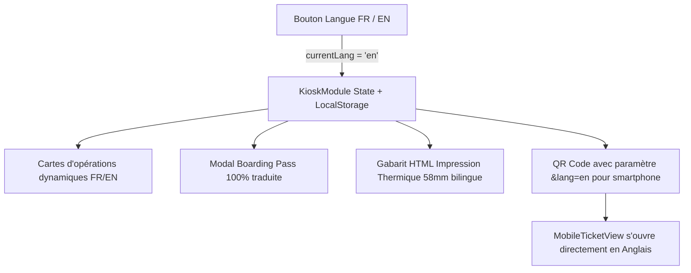

# 📋 Plan d'Implémentation & Correction Bilingue Complète (FR / EN)
## Module Borne Tactile (Kiosk) & Impression Thermique — COFINA Togo

---

## 1. 🔍 Diagnostic & Analyse de l'Existant

Lorsqu'un utilisateur clique sur le bouton **`EN`** dans le pied de page de la borne tactile :
- ✅ Seuls quelques textes statiques de base (`TEXTS.en`) basculent en anglais (titre d'accueil, sous-titre, modal d'aide).
- ❌ **Les 12 cartes de services** restent en français ("Dépôt", "Retrait", "Transfert national", "Ouverture de compte", etc.) car elles sont issues statiquement de `COFINA_SERVICES.name`.
- ❌ **La modal du ticket (Boarding Pass)** conserve des éléments en français :
  - Le libellé du service sous le numéro (issu de l'opération en français).
  - L'estimation de file d'attente : *"Vous êtes le prochain ! Approchez-vous d'un guichet"* / *"x personnes avant vous"*.
  - Les boutons d'action : *"🖨️ IMPRIMER MON TICKET PAPIER"*, *"Impression en cours…"*, *"✓ Reçu papier imprimé !"*.
  - Le bouton secondaire : *"Terminer sans imprimer (25s)"*, *"Fermer l'écran (3s)"*, *"Terminer - Ticket sur mobile"*.
  - La section QR code : *"TICKET NUMÉRIQUE"*, *"SUIVI EN DIRECT SUR MOBILE"*, *"✓ Ticket actif sur mobile !"*, *"Ouvrir le ticket mobile"*.
  - Le format de date (`toLocaleDateString('fr-FR')`).
- ❌ **Le ticket thermique imprimé (reçu papier 58mm)** reste entièrement en français :
  - `"VOTRE NUMÉRO :"` au lieu de `"YOUR TICKET NUMBER:"`
  - Le nom du service en français (`"Retrait"` au lieu de `"Withdrawal"`)
  - `"★ ACCÈS PRIORITAIRE VIP ★"` au lieu de `"★ VIP PRIORITY ACCESS ★"`
  - `"Merci de patienter votre appel"` au lieu de `"Please wait to be called"`
  - Format de date/heure en `fr-FR`.
- ❌ **Persistance et passage au mobile** :
  - La langue sélectionnée sur la borne n'est pas répercutée dans l'URL du QR Code (`?ticket=R-003&lang=en`), ce qui fait que le client ouvrant son ticket sur son smartphone le voyait en français par défaut.

---

## 2. 🏗️ Architecture Cible de la Correction



### Table de correspondance des 12 Services COFINA :
| Code | Nom Français | English Name | Description FR | Description EN |
|:---:|:---|:---|:---|:---|
| **D** | Dépôt | **Deposit** | Versements espèces | Cash deposit |
| **R** | Retrait | **Withdrawal** | Retraits caisse | Cash withdrawal |
| **TN** | Transfert national | **Domestic Transfer** | Envoi/Réception national | Domestic money transfer |
| **TI** | Transfert international | **International Transfer** | Western Union, RIA, MoneyGram | International remittance |
| **O** | Ouverture de compte | **Account Opening** | Nouveaux comptes | New account & onboarding |
| **RC** | Remise de chèque | **Check Deposit** | Dépôt de chèques | Check clearing & deposit |
| **V** | Virement | **Bank Transfer** | Virement bancaire | Account & wire transfer |
| **DR** | Demande de Relevé | **Account Statement** | Relevé de compte | Statement & balance inquiry |
| **CM** | COFINA Mobile+ | **COFINA Mobile+** | Assistance services digitaux | Digital banking support |
| **C** | Crédit | **Loan Application** | Demande de prêt / microfinance | Credit & micro-loan requests |
| **PC** | Parler à un conseiller | **Customer Advisor** | Conseils & accompagnement | Speak with an advisor |
| **PMR** | Mobilité Réduite | **Priority / Accessibility** | Accès prioritaire femmes enceintes / aînés | Elderly, pregnant, disability priority |

---

## 3. 📝 Détail des Modifications à Apporter

### Étape 1 : Enrichir `src/services/config/constants.js`
Ajouter les propriétés `nameEn` et `descriptionEn` aux 12 services de `COFINA_SERVICES`, et exporter un helper `getServiceName(serviceCode, lang)` :

```javascript
export const getServiceName = (serviceCode, lang = 'fr') => {
  const service = COFINA_SERVICES.find(s => s.code === serviceCode);
  if (!service) return lang === 'en' ? 'Customer Service' : 'Service Client';
  return lang === 'en' ? (service.nameEn || service.name) : service.name;
};
```

---

### Étape 2 : Étendre le dictionnaire `TEXTS` dans `KioskModule.jsx`

Compléter `TEXTS.fr` et `TEXTS.en` pour couvrir l'intégralité du cycle de vie du ticket :

```javascript
const TEXTS = {
  fr: {
    welcomeTitle: 'BIENVENUE A COFINA TOGO',
    welcomeSub: 'Institution Panafricaine de la Finance Inclusive\nVeuillez sélectionner votre opération',
    helpBtn: "Besoin d'aide ?",
    ticketLabel: 'VOTRE NUMÉRO DE PASSAGE',
    waitNotice: "Veuillez vous asseoir en salle d'attente. Votre numéro sera annoncé à l'écran TV.",
    resetText: "Retour à l'accueil dans",
    finishBtn: "TERMINER / RETOUR À L'ACCUEIL",
    helpTitle: 'Assistance & Orientation Client',
    helpBody: "Veuillez vous adresser directement à l'un de nos agents d'accueil présents dans le hall pour vous guider et vous assister dans vos démarches. Vous pouvez également contacter notre Assistance au 92686060.",
    closeBtn: 'Fermer',
    audioNotice: "Ticket créé, veuillez prendre place en salle d'attente",
    processingText: 'Génération de votre ticket…',
    qrHeader: 'TICKET NUMÉRIQUE',
    qrSub: "Ouvrez l'appareil photo de votre téléphone ou une application lecteur QR et visez ce code pour suivre votre rang",
    liveTracking: 'SUIVI EN DIRECT SUR MOBILE',
    activeOnMobile: '✓ Ticket actif sur mobile !',
    openMobileTicket: 'Ouvrir le ticket mobile',
    
    // Boutons & Actions
    printBtn: '🖨️ IMPRIMER MON TICKET PAPIER',
    printingBtn: 'Impression en cours…',
    printedBtn: '✓ Reçu papier imprimé !',
    closeAutoBtn: (sec) => `Fermer l'écran (${sec}s)`,
    finishMobileBtn: (sec) => `Terminer - Ticket sur mobile (${sec}s)`,
    finishNoPrintBtn: (sec) => `Terminer sans imprimer (${sec}s)`,
    
    // Attente & File
    nextInLine: "🎉 Vous êtes le prochain ! Approchez-vous d'un guichet.",
    peopleAhead: (count, min) => `👥 ~${count} personne${count > 1 ? 's' : ''} avant vous · Attente estimée ~${min} min`,

    // Reçu thermique imprimé 58mm
    thermalTicketNumLabel: 'VOTRE NUMÉRO :',
    thermalVipBadge: '★ ACCÈS PRIORITAIRE VIP ★',
    thermalFooterNotice: 'Merci de patienter votre appel',
    
    // Accessibilité
    a11yStandard: 'Mode Standard',
    a11yHighContrast: 'Contraste Élevé (A11y)'
  },
  en: {
    welcomeTitle: 'WELCOME TO COFINA TOGO',
    welcomeSub: 'Pan-African Inclusive Finance Institution\nPlease select your transaction',
    helpBtn: 'Need help?',
    ticketLabel: 'YOUR TICKET NUMBER',
    waitNotice: 'Please take a seat in the waiting area. Your number will be announced on the screen.',
    resetText: 'Returning home in',
    finishBtn: 'FINISH / RETURN TO HOME',
    helpTitle: 'Customer Assistance & Guidance',
    helpBody: 'Please speak directly with one of our welcoming agents in the hall to assist you. You can also reach our Helpline at 92686060.',
    closeBtn: 'Close',
    audioNotice: 'Ticket issued, please have a seat in the waiting area',
    processingText: 'Generating your ticket…',
    qrHeader: 'DIGITAL TICKET',
    qrSub: 'Open your phone camera or QR scanner app and point it at this code to track your turn',
    liveTracking: 'LIVE TRACKING ON MOBILE',
    activeOnMobile: '✓ Ticket active on mobile!',
    openMobileTicket: 'Open mobile ticket',
    
    // Boutons & Actions
    printBtn: '🖨️ PRINT MY PAPER TICKET',
    printingBtn: 'Printing in progress…',
    printedBtn: '✓ Paper receipt printed!',
    closeAutoBtn: (sec) => `Close screen (${sec}s)`,
    finishMobileBtn: (sec) => `Done - Ticket on mobile (${sec}s)`,
    finishNoPrintBtn: (sec) => `Done without printing (${sec}s)`,
    
    // Attente & File
    nextInLine: '🎉 You are next! Please proceed to a counter.',
    peopleAhead: (count, min) => `👥 ~${count} person${count > 1 ? 's' : ''} ahead of you · Estimated wait ~${min} min`,

    // Reçu thermique imprimé 58mm
    thermalTicketNumLabel: 'YOUR NUMBER:',
    thermalVipBadge: '★ VIP PRIORITY ACCESS ★',
    thermalFooterNotice: 'Please wait to be called',
    
    // Accessibilité
    a11yStandard: 'Standard Mode',
    a11yHighContrast: 'High Contrast (A11y)'
  }
};
```

---

### Étape 3 : Rendre la génération des 12 cartes sensible à `currentLang`

Remplacer la constante globale `OPERATIONS` par un mapping réactif dans `KioskModule` :

```javascript
const operations = useMemo(() => {
  return COFINA_SERVICES.map(s => ({
    id: `op-${s.code.toLowerCase()}`,
    code: s.code,
    label: currentLang === 'en' ? (s.nameEn || s.name) : s.name,
    iconName: s.icon
  }));
}, [currentLang]);
```

---

### Étape 4 : Mettre à jour le gabarit d'impression thermique 58mm

Dans `handlePrintTicket()` et dans la balise `#cofina-thermal-ticket` :
- Utiliser `txt.thermalTicketNumLabel` (`"YOUR NUMBER:"`)
- Récupérer le label traduit du service via `getServiceName(currentTicket.serviceCode, currentLang)`
- Afficher `txt.thermalVipBadge` (`"★ VIP PRIORITY ACCESS ★"`)
- Afficher la date selon la locale :
  ```javascript
  const dateStr = now.toLocaleDateString(currentLang === 'en' ? 'en-US' : 'fr-FR', {
    day: '2-digit', month: '2-digit', year: 'numeric'
  });
  const timeStr = now.toLocaleTimeString(currentLang === 'en' ? 'en-US' : 'fr-FR', {
    hour: '2-digit', minute: '2-digit'
  });
  ```
- Afficher `txt.thermalFooterNotice` (`"Please wait to be called"`).

---

### Étape 5 : Propager la langue vers le QR Code mobile

Dans l'URL du QR Code générée par la borne :
```javascript
const qrTargetUrl = `${lanBaseUrl}/?ticket=${cleanNum}&lang=${currentLang}`;
```
Ainsi, lorsque le smartphone du client scanne le code :
1. `App.jsx` reçoit le paramètre `lang=en`.
2. Le `MobileTicketView` s'affiche immédiatement en Anglais pour le client.

---

### Étape 6 : Synchroniser avec `localStorage` & `App.jsx`

Lors du clic sur le commutateur de langue :
```javascript
const handleLanguageSwitch = (newLang) => {
  setCurrentLang(newLang);
  try {
    localStorage.setItem('cofina_lang_v1', newLang);
  } catch (_) {}
  if (onLangChange) onLangChange(newLang);
};
```

---

## 4. 🚀 Plan de Déploiement & Validation

1. **Mise à jour de `constants.js`** avec `nameEn` pour les 12 services et export de `getServiceName()`.
2. **Mise à jour de `KioskModule.jsx`** avec le dictionnaire `TEXTS` complet, le mapping réactif des cartes, et les gabarits d'impression bilingues.
3. **Mise à jour de l'URL QR Code** avec `&lang=${currentLang}`.
4. **Validation par build & tests** :
   - `npm run build`
   - `npm test`
   - Test visuel sur la borne tactile en mode `FR` et en mode `EN`.
5. **Livraison Git** :
   - Commit & push sur `origin/main`.
