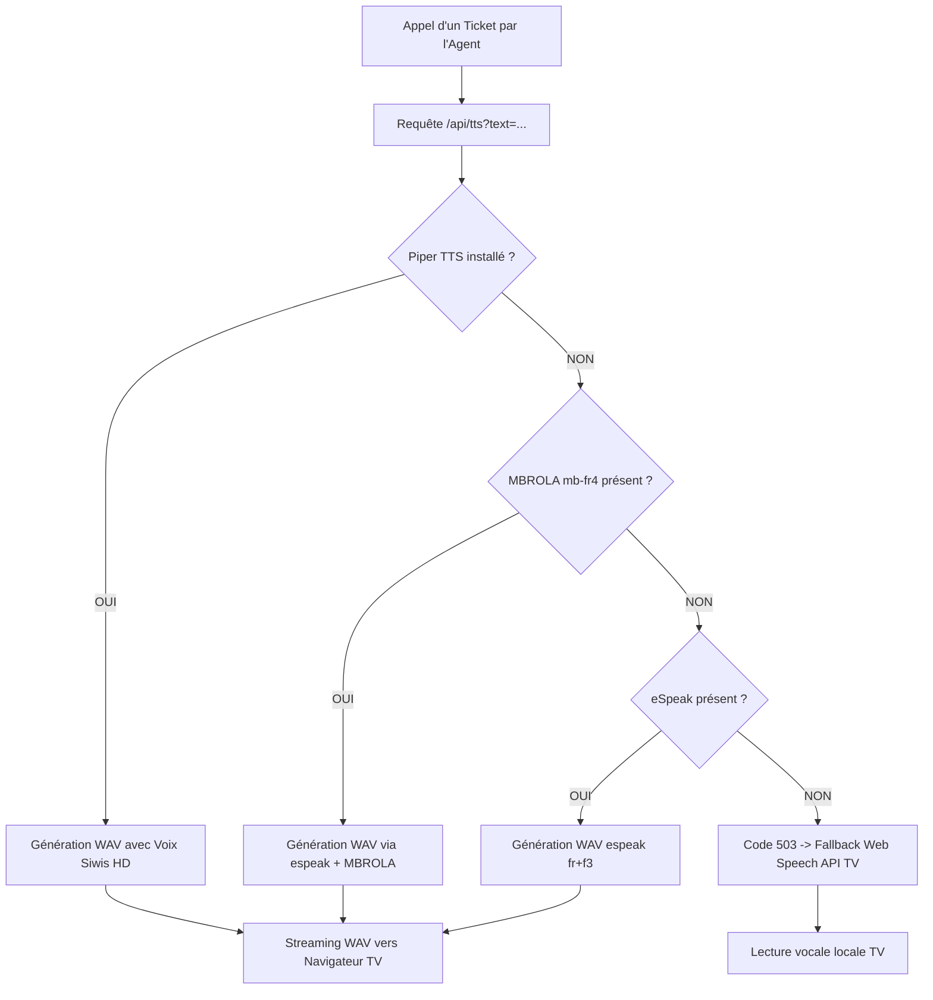

# 🔊 Guide d'Amélioration & Alternatives Sonores pour l'Annonce Vocale TV (TTS)
## Système de Gestion de File d'Attente — COFINA Togo (Agence Siège Kodjoviakopé)

---

## 1. 🔍 Diagnostic : Pourquoi eSpeak sonne-t-il "robotique" ?

Le moteur **eSpeak / eSpeak-NG** utilise une synthèse vocale dite **par formants** (technologie des années 1990) :
- **Avantages** : Extrêmement léger (< 5 Mo de RAM), aucun GPU requis, fonctionne sur n'importe quel processeur.
- **Inconvénients** : La voix est synthétisée de manière purement algorithmique sans enregistrements humains naturels. Le timbre est métallique, monotone et ressemble à une voix de robot, ce qui ne reflète pas l'image d'accueil chaleureuse et haut de gamme d'une institution financière comme **COFINA Togo**.

---

## 2. 🏆 Tableau Comparatif des 4 Alternatives

| Solution | Qualité Vocale | Connexion Internet | Coût | Latence | Compatibilité Ubuntu |
| :--- | :---: | :---: | :---: | :---: | :---: |
| **1. Piper TTS** *(Recommandé n°1 Local)* | 🌟🌟🌟🌟🌟 *(Humaine & Chaleureuse)* | ❌ **100% Hors-ligne** | **Gratuit / Open-source** | < 120 ms | ✅ Binaire Linux x86_64 autonome |
| **2. Edge-TTS (Microsoft Neural)** | 🌟🌟🌟🌟🌟 *(Qualité Studio / Aéroport)* | 🌐 Internet requis | **Gratuit (sans clé)** | ~300 ms | ✅ Python ou script Node.js |
| **3. Web Speech API (Navigateur TV)** | 🌟🌟🌟🌟 *(Naturelle selon TV)* | Dépend de l'OS TV | **Gratuit** | Instantané | ✅ Déjà intégré dans le code |
| **4. MBROLA fr4 (Extension eSpeak)** | 🌟🌟🌟 *(Moins métallique)* | ❌ **100% Hors-ligne** | **Gratuit** | Instantané | ✅ `sudo apt install mbrola mbrola-fr4` |

---

## 3. 🥇 Recommandation N°1 : PIPER TTS (100% Local, Voix IA Neuronale, Zéro Internet)

**Piper TTS** est un moteur de synthèse vocale neuronal open-source ultra-rapide optimisé pour les processeurs x86 et ARM (développé par *Nabu Casa / Home Assistant*).

### Pourquoi est-ce le choix idéal pour COFINA Togo ?
1. **100% Autonome en agence** : Aucune dépendance à la connexion Internet ou à la bande passante. Même si la fibre ou le réseau mobile est coupé, la voix continue d'annoncer les tickets sans interruption.
2. **Qualité vocale d'hôtesse d'accueil** : Le modèle français **"Siwis" (`fr_FR-siwis-medium`)** est une voix féminine douce, fluide et parfaitement articulée.
3. **Architecture directe avec Node.js** : Piper prend le texte en entrée standard (`stdin`) et renvoie directement le flux audio WAV sur la sortie standard (`stdout`), qui est streamé à la télévision en temps réel.

### Procédure d'installation sur le Serveur Ubuntu :

```bash
# 1. Télécharger le binaire autonome Piper Linux x86_64
cd /tmp
wget https://github.com/rhasspy/piper/releases/download/v1.2.0/piper_linux_x86_64.tar.gz
tar -xzf piper_linux_x86_64.tar.gz
sudo mv piper/piper /usr/local/bin/piper
sudo chmod +x /usr/local/bin/piper

# 2. Créer le dossier pour les modèles de voix
sudo mkdir -p /opt/piper-voices
cd /opt/piper-voices

# 3. Télécharger la voix féminine française (Siwis Medium)
sudo wget https://huggingface.co/rhasspy/piper-voices/resolve/main/fr/fr_FR/siwis/medium/fr_FR-siwis-medium.onnx
sudo wget https://huggingface.co/rhasspy/piper-voices/resolve/main/fr/fr_FR/siwis/medium/fr_FR-siwis-medium.onnx.json

# 4. Test immédiat depuis le terminal :
echo "Ticket R-003, veuillez vous présenter au guichet 1." | piper --model /opt/piper-voices/fr_FR-siwis-medium.onnx --output-file /tmp/test_annonce.wav

# Vérifier que le fichier fait bien ~80 Ko de son WAV haute qualité :
ls -lh /tmp/test_annonce.wav
```

---

## 4. 🥈 Alternative N°2 : Microsoft Edge-TTS (Voix Neurales Studio)

Si le serveur dispose d'une connexion Internet stable, **Edge-TTS** permet d'utiliser gratuitement les voix de synthèse de Microsoft Azure sans avoir besoin de créer de compte Azure ni de clé API.

- **Voix disponibles** : `fr-FR-DeniseNeural` (voix féminine de référence) et `fr-FR-HenriNeural` (voix masculine posée).
- **Mise en cache intelligente** :
  Le serveur génère le fichier MP3/WAV lors du premier appel et le sauvegarde dans un cache local (`/server/cache/audio/`).
  Les phrases récurrentes (*"Ticket"*, *"veuillez vous présenter au guichet"*, etc.) sont ainsi réutilisables instantanément, même en cas de coupure temporaire d'Internet.

### Installation sur Ubuntu :
```bash
sudo apt install -y python3-pip
pip3 install edge-tts
# Test :
edge-tts --voice fr-FR-DeniseNeural --text "Ticket D-001, guichet 2" --write-media /tmp/test_denise.mp3
```

---

## 5. 🥉 Alternative N°3 : Voix du Navigateur de la Télévision (Web Speech API)

Si la télévision est raccordée à un **Mini-PC (ChromeOS, Windows ou Linux Ubuntu Desktop)** :
- Les navigateurs Google Chrome ou Microsoft Edge intègrent déjà des voix de très haute qualité fournies par le système d'exploitation (`Google français`, `Microsoft Denise Online (Natural)`).
- Dans ce scénario, le serveur n'a pas besoin de calculer l'audio : c'est le navigateur de la TV qui prononce l'annonce en direct avec sa carte son.
- Le fichier `audioHelpers.js` contient déjà cette implémentation via `window.speechSynthesis`.

---

## 6. ⚡ Alternative N°4 : MBROLA fr4 (Amélioration immédiate sans nouveau logiciel)

Si vous souhaitez conserver `espeak-ng` mais adoucir le rendu métallique :
```bash
sudo apt update
sudo apt install -y mbrola mbrola-fr4
```
Le routeur `server/src/routes/tts.routes.ts` détecte automatiquement `mb-fr4` au démarrage. Le son devient plus feutré et audible dans le hall d'attente.

---

## 7. 🛠️ Architecture Recommandée pour le Serveur COFINA (`tts.routes.ts`)

Pour garantir une robustesse maximale (haute disponibilité), le serveur appliquera une stratégie de **fallback en cascade à 4 niveaux** :



### Extrait du code cible pour `server/src/routes/tts.routes.ts` :

```typescript
// Détection automatique en cascade au démarrage du serveur
function detectBestTTSEngine(): { engine: 'piper' | 'mbrola' | 'espeak' | null, command: string, args: string[] } {
  // 1. Priorité N°1 : Piper TTS (Voix Neuronale HD locale)
  const piperCheck = spawnSync('which', ['piper'], { encoding: 'utf8' });
  const modelExists = fs.existsSync('/opt/piper-voices/fr_FR-siwis-medium.onnx');
  if (piperCheck.status === 0 && modelExists) {
    console.log('[TTS] 🌟 Moteur Vocal IA Piper TTS détecté (/opt/piper-voices/fr_FR-siwis-medium.onnx)');
    return {
      engine: 'piper',
      command: 'piper',
      args: ['--model', '/opt/piper-voices/fr_FR-siwis-medium.onnx', '--output-raw']
    };
  }

  // 2. Priorité N°2 : MBROLA Studio
  const espeakCheck = spawnSync('which', ['espeak-ng', 'espeak'], { encoding: 'utf8' });
  if (espeakCheck.status === 0) {
    const cmd = espeakCheck.stdout.trim().split('\n')[0];
    const mbrolaCheck = spawnSync(cmd, ['-v', 'mb-fr4', '--stdout', 'test'], { encoding: 'utf8' });
    if (mbrolaCheck.status === 0) {
      console.log('[TTS] 💎 Moteur MBROLA fr4 détecté');
      return { engine: 'mbrola', command: cmd, args: ['-v', 'mb-fr4', '-s', '120', '--stdout'] };
    }
    // 3. Priorité N°3 : eSpeak natif
    return { engine: 'espeak', command: cmd, args: ['-v', 'fr+f3', '-s', '115', '-p', '58', '--stdout'] };
  }

  // 4. Aucun moteur serveur : le navigateur prendra le relais
  return { engine: null, command: '', args: [] };
}
```

---

## 8. 🎯 Conclusion & Recommandation Opérationnelle

Pour l'agence de **Kodjoviakopé** :
1. Installer **Piper TTS** avec la voix **`fr_FR-siwis-medium`** sur la machine Ubuntu (prend moins de 2 minutes en copiant/collant les commandes de la section 3).
2. Cela donnera à l'agence une voix d'annonce **claire, posée, chaleureuse et 100% autonome**.
