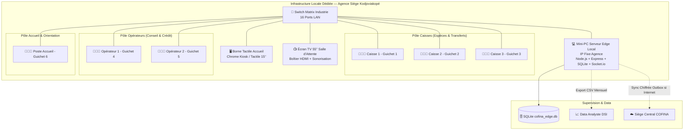
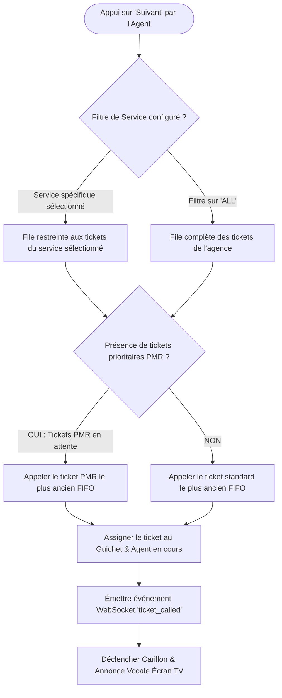

# 📘 COFINA QUEUE SYSTEM — Manuel & Architecture Technique (Serveurs Edge Hors-Ligne)

> **Client** : Groupe COFINA Togo (Microfinance — Agence Pilote Siège Kodjoviakopé & Réseau d'Agences de Lomé)  
> **Auteur / Prestataire** : Matrix Industrie  
> **Architecture** : Serveur Edge Local 100% Autonome (Fonctionnement garanti Hors-Ligne / Sans Internet)  
> **Version** : 2.1 — Configuration Agence Réelle (6 Postes Dédiés & Routage Spécialisé par Service)

---

## 📋 SOMMAIRE

1. [Contexte Métier & Principes Directeurs](#1-contexte-métier--principes-directeurs)
2. [Topologie des Postes de l'Agence Siège (6 Guichets Dédiés)](#2-topologie-des-postes-de-lagence-siège-6-guichets-dédiés)
3. [Configuration & Routage des 12 Services par Poste](#3-configuration--routage-des-12-services-par-poste)
4. [Architecture Réseau Local & Matériel (Edge LAN)](#4-architecture-réseau-local--matériel-edge-lan)
5. [Description Détaillée des Modules](#5-description-détaillée-des-modules)
   - [5.1 🖥️ Borne Tactile d'Accueil (`KioskModule.jsx`)](#51-️-borne-tactile-daccueil-kioskmodulejsx)
   - [5.2 📺 Écran TV Public & Synthèse Vocale (`DisplayModule.jsx`)](#52--écran-tv-public--synthèse-vocale-displaymodulejsx)
   - [5.3 👨🏽‍💼 Station Agent Dédiée (`AgentModule.jsx`)](#53--station-agent-dédiée-agentmodulejsx)
   - [5.4 📱 Widget Bureau Flottant Indépendant (`FloatingTellerWidget.jsx`)](#54--widget-bureau-flottant-indépendant-floatingtellerwidgetjsx)
   - [5.5 👤 Page Profil Agent & KPIs (`ProfilePage.jsx`)](#55--page-profil-agent--kpis-profilepagejsx)
6. [Algorithme d'Appel & Gestion des Files d'Attente](#6-algorithme-dappel--gestion-des-files-dattente)
7. [Stratégie de Consolidation Multi-Agences & Reporting](#7-stratégie-de-consolidation-multi-agences--reporting)
8. [Sécurité, Sauvegardes & Résilience Hors-Ligne](#8-sécurité-sauvegardes--résilience-hors-ligne)

---

## 1. Contexte Métier & Principes Directeurs

Le système est spécialement conçu pour le secteur de la microfinance en Afrique de l'Ouest (Lomé, Togo). Il prend en compte les contraintes d'infrastructures locales, notamment **les coupures fréquentes de connexion internet et les fluctuations électriques**.

### 🌟 Principes Clés
1. **Autonomie 100% Hors-Ligne** : L'ensemble de la file d'attente (Borne, Écran TV, Postes Caisses, Postes Opérateurs, Poste Accueil) fonctionne en réseau local interne (LAN / Switch dédié). **Aucune connexion internet n'est requise** pour le bon déroulement des opérations quotidiennes.
2. **Un Collaborateur = Un Seul Poste de Travail Dédié** : Chaque agent physique est connecté sur sa propre machine / guichet. Il ne pilote qu'un guichet à la fois et ne visualise que les informations le concernant, sans confusion multi-guichets.
3. **Zéro Barrière Digitale & Priorité QR Code** : Dès la sélection du service sur la borne tactile, le **QR Code Mobile** est présenté comme moyen principal de suivi sur smartphone. L'impression thermique papier (ESC/POS 80mm/58mm) reste disponible en alternative immédiate.
4. **Annonce Audio d'Appel au Guichet** :
   - *Sur la Borne* : Confirmation visuelle immédiate (sans synthèse vocale pour ne pas saturer l'accueil).
   - *Au Guichet & Écran TV* : Carillon Gong sonorisé bi-tonal + Synthèse vocale de passage (*"Ticket D-008, veuillez passer à la Caisse 2"* ou *"Ticket C-012, veuillez passer auprès de l'Opérateur 1"*).
5. **Suivi Fin du Cycle de Traitement (`startedAt` $\rightarrow$ `completedAt`)** :
   - Traçabilité précise de la durée de chaque opération (attente client, prise en charge `IN_PROGRESS`, clôture `COMPLETED`).
   - Calcul et exportation CSV des métriques de productivité par agent et par typologie de service.

---

## 2. Topologie des Postes de l'Agence Siège (6 Guichets Dédiés)

L'Agence Siège de Kodjoviakopé est organisée en **6 postes de travail physiques distincts**, répartis selon 3 métiers complémentaires :

| Numéro de Guichet | Désignation Métier | Profil Agent / Rôle | Type d'opérations principales |
| :---: | :--- | :--- | :--- |
| **Guichet 1** | **Caisse 1** | Caissier (Espèces & Transferts) | Dépôts, Retraits, Transferts, Versements |
| **Guichet 2** | **Caisse 2** | Caissier (Espèces & Transferts) | Dépôts, Retraits, Transferts, Versements |
| **Guichet 3** | **Caisse 3** | Caissier (Chèques & Opérations) | Remise de chèques, Dépôts/Retraits, Virements |
| **Guichet 4** | **Opérateur 1** | Chargé de Clientèle / Conseiller | Ouvertures de compte, Demandes de Crédit, SAV |
| **Guichet 5** | **Opérateur 2** | Conseiller Clientèle / Microfinance | Crédit, COFINA Mobile+, Conseils personnalisés |
| **Guichet 6** | **Accueil & Orientation** | Hôtesse d'Accueil / Chargé d'Information | Renseignements, Aide borne, Priorité PMR |

> 📌 **Principe d'Affectation Fixe** :  
> Chaque agent dispose d'un compte avec son nom, son avatar et son guichet par défaut. À l'ouverture de sa session de travail, l'interface se verrouille sur son guichet attitré. L'agent ne manipule **qu'un seul poste à la fois**.

---

## 3. Configuration & Routage des 12 Services par Poste

Le système gère les **12 services officiels COFINA Togo**. Chaque poste de travail est configuré pour ne traiter que les services relevant de son pôle de compétence, grâce au **filtrage dynamique par service**.

### 3.1 Référentiel des 12 Services COFINA Togo

| Code | Libellé Officiel | Pôle Métier Assigné | Durée Moyenne | Icône Borne |
| :---: | :--- | :--- | :---: | :---: |
| **D** | Dépôt d'espèces | Caisses 1, 2, 3 | ~3 min | 💵 `Banknote` |
| **R** | Retrait d'espèces | Caisses 1, 2, 3 | ~3 min | 👛 `Wallet` |
| **TN** | Transfert national | Caisses 1, 2, 3 | ~5 min | 📤 `Send` |
| **TI** | Transfert international (Western Union, MoneyGram...) | Caisses 1, 2 | ~8 min | 🌐 `Globe` |
| **RC** | Remise de chèque | Caisse 3, Opérateurs | ~4 min | 📑 `FileCheck` |
| **V** | Virement bancaire | Caisse 3, Opérateurs | ~5 min | 🔄 `ArrowRightLeft` |
| **O** | Ouverture de compte | Opérateurs 1, 2 | ~15 min | 👤 `UserPlus` |
| **C** | Crédit & Demande de prêt | Opérateurs 1, 2 | ~20 min | 💳 `CreditCard` |
| **PC** | Parler à un conseiller | Opérateurs 1, 2 | ~15 min | 🎧 `Headphones` |
| **DR** | Demande de relevé bancaire | Opérateurs, Accueil | ~3 min | 📄 `FileText` |
| **CM** | COFINA Mobile+ & Digitalisation | Opérateurs, Accueil | ~5 min | 📱 `Smartphone` |
| **PMR** | Mobilité Réduite / Femmes Enceintes (Prioritaire) | Tous Guichets (Priorité Accueil & Caisse 1) | ~5 min | ♿ `Accessibility` |

### 3.2 Matrice de Routage & Configuration par Guichet

Chaque poste peut opérer sous deux modes de filtrage :
1. **Mode Spécialisé (Recommandé en heure de pointe)** : Le guichet ne tire dans la file d'attente que les tickets correspondant strictement à ses services (ex. Caisse 1 ne traite que `D`, `R`, `TN`).
2. **Mode Polyvalent / Débordement (Heures creuses)** : Lorsque sa file dédiée est vide, l'agent peut basculer sur `ALL` (Tous les services) pour désengorger les autres pôles de l'agence.

```
BORNE TACTILE (12 Services)
      │
      ├──▶ Flux Espèces & Monétique (D, R, TN, TI, RC, V) ────────▶ [Caisse 1, 2, 3]
      │
      ├──▶ Flux Conseil & Commercial (O, C, PC, CM, DR) ──────────▶ [Opérateur 1, 2]
      │
      └──▶ Flux Accueil, Renseignements & Vulnérabilité (PMR, Info) ─▶ [Poste Accueil]
```

---

## 4. Architecture Réseau Local & Matériel (Edge LAN)

Le système de file d'attente est déployé sur un **switch 16 ports indépendant**, relié par une simple liaison montante (1 port) au switch principal COFINA Togo.



### URLs d'Accès par Type de Poste (IP fixe locale du Mini-PC)

| Équipement | URL Réseau Local | Mode de Navigation |
|---|---|---|
| **Borne Tactile** | `http://<IP_SERVEUR>:3000/?kiosk=true` | Plein écran tactile Kiosk |
| **Écran TV Salle d'Attente** | `http://<IP_SERVEUR>:3000/?display=true` | Plein écran TV avec audio activé |
| **Poste Agent (PC Caissier / Opérateur / Accueil)** | `http://<IP_SERVEUR>:3000/` | Navigateur standard |
| **Widget Flottant Indépendant (Poste Agent)** | `http://<IP_SERVEUR>:3000/?widgetOnly=true` | Mini-fenêtre Always-on-top |
| **Console Administration & Superviseur** | `http://<IP_SERVEUR>:3000/?admin=true` | Accès sécurisé RBAC (ADMIN) |
| **Endpoint Healthcheck (Uptime Kuma)** | `http://<IP_SERVEUR>:4000/health` | Supervision JSON automatisée |

---

## 5. Description Détaillée des Modules

### 5.1 🖥️ Borne Tactile d'Accueil (`KioskModule.jsx`)
- **Écran de sélection des 12 services** avec icônes distinctes et codes couleurs COFINA Togo.
- **Accès Prioritaire 1-Clic PMR** : Détection des personnes à mobilité réduite, seniors et femmes enceintes avec attribution immédiate d'un ticket prioritaire `PMR-xxx`.
- **Délivrance Zéro Contact** : Affichage instantané d'un **QR Code haute résolution** scannable par le client avec son smartphone pour suivre sa position dans la file en temps réel (mise à jour via WebSocket).
- **Impression thermique d'appoint** : Découpe automatique du ticket papier ESC/POS si le client préfère le format papier.

### 5.2 📺 Écran TV Public & Synthèse Vocale (`DisplayModule.jsx`)
- **Vue d'ensemble des 6 guichets en temps réel** :
  - **Pôle Caisses** : État de la Caisse 1, Caisse 2, Caisse 3.
  - **Pôle Opérateurs** : État de l'Opérateur 1, Opérateur 2.
  - **Pôle Accueil** : État du Poste Accueil.
- **Bannière d'Appel "Spotlight"** : Lorsqu'un ticket est appelé, une animation visuelle plein écran met en valeur le numéro et le guichet de destination.
- **Sonorisation Bimodale** :
  1. *Carillon Attention* : Sonnette 2 tons haute clarté.
  2. *Synthèse Vocale Web Audio* : Annonce vocale dynamique en français local (*"Numéro D-015, Caisse 2"*).
- **Bandeau d'Information Défilant** : Messages institutionnels COFINA (création compte PI-SPI, consignes de sécurité, documents requis).

### 5.3 👨🏽‍💼 Station Agent Dédiée (`AgentModule.jsx`)
- **Session Individuelle Personnalisée** : L'agent sélectionne son identifiant ou se connecte à son profil. Son guichet attitré est automatiquement pré-sélectionné.
- **Bouton d'Ouverture / Fermeture de Guichet** :
  - `🟢 Guichet Ouvert` : Le poste est disponible et éligible à la distribution automatique de tickets.
  - `🔴 Guichet Fermé` : Pause, clôture de caisse ou fin de journée ; les tickets sont réorientés vers les autres postes ouverts.
- **Barre de Contrôle d'Appel** :
  - **Suivant (<kbd>▶</kbd>)** : Appelle le prochain client selon les services configurés pour le poste.
  - **En Traitement (<kbd>⏱</kbd>)** : Déclenche le chronomètre de service dès l'installation du client au guichet.
  - **Rappeler (<kbd>🔄</kbd>)** : Relance l'annonce sonore et vocale à l'écran TV en cas de non-présentation immédiate.
  - **Absent / No-Show (<kbd>👤❌</kbd>)** : Marque le ticket comme abandonné après 3 appels infructueux.
  - **Terminer (<kbd>✔</kbd>)** : Clôture le ticket, enregistre la durée totale et libère le guichet.
- **Sélecteur de Service** : Permet à l'agent de verrouiller son appel sur un service précis (`D`, `R`, `C`, etc.) ou d'englober tous les services (`ALL`).

### 5.4 📱 Widget Bureau Flottant Indépendant (`FloatingTellerWidget.jsx`)
- Conçu spécifiquement pour les caissiers travaillant simultanément sur le progiciel bancaire (*Amplitude Core Banking*) ou *Excel*.
- Se détache dans une mini-fenêtre ultra-compacte (`360px x 420px`) restant au premier plan.
- Fournit l'intégralité des commandes d'appel sans avoir à basculer constamment d'application.

### 5.5 👤 Page Profil Agent & KPIs (`ProfilePage.jsx`)
- Gestion de l'identité de l'agent (Nom, Titre, Guichet par défaut, Avatar photo).
- **Indicateurs de Performance en Temps Réel** :
  - Nombre de clients servis dans la journée.
  - Temps moyen de prise en charge (DMT - Durée Moyenne de Traitement).
  - Taux de complétion et respect des standards qualité COFINA.
- **Système de Badges d'Émulation** : *Rapidité*, *Assiduité*, *Performance*, *Excellence Relation Client*.

---

## 6. Algorithme d'Appel & Gestion des Files d'Attente

L'attribution du prochain ticket lors de l'appui sur **"Suivant"** (géré via l'endpoint `/api/tickets/call-next` avec le paramètre de filtrage multicritères `serviceFilter`) obéit à la règle stricte suivante :



1. **Priorité Absolue PMR** : Tout ticket portant le fanion de priorité est systématiquement appelé avant les tickets réguliers de la file, quel que soit son ordre d'arrivée.
2. **Respect de l'Ordre Chronologique (FIFO)** : Au sein d'une même catégorie de priorité, les clients sont servis selon l'ordre strict de création de leur ticket.
3. **Respect du Guichet Spécialisé** : Si le guichet est configuré sur le service `C` (Crédit), seuls les tickets de crédit lui sont attribués, garantissant que les dossiers complexes ne perturbent pas la file des caisses rapides.

---

## 7. Stratégie de Consolidation Multi-Agences & Reporting

Chaque agence du réseau COFINA Togo dispose de son propre **Serveur Edge Local autonome**. La consolidation globale au niveau de la Direction Générale et de la DSI s'opère selon deux modalités complémentaires :

### 7.1 Mode Déconnecté / Mensuel (Standard DSI)
- À la fin de chaque journée ou chaque mois, le Responsable d'Agence ou le Data Analyste clique sur **"Export CSV"** depuis la console.
- Le fichier CSV standardisé contient l'ensemble des horodatages précis :  
  `ID Ticket`, `Numéro`, `Code Service`, `Nom Service`, `Prioritaire`, `Guichet`, `Agent`, `Créé Le`, `Appelé Le`, `Début Traitement`, `Terminé Le`, `Attente (min)`, `Traitement (min)`.
- Ces fichiers alimentent les tableaux de bord décisionnels PowerBI / Metabase de la Direction Générale.

### 7.2 Mode Synchronisation Différée Automatique (`SyncOutbox`)
- Chaque action (`TICKET_CREATED`, `TICKET_CALLED`, `TICKET_COMPLETED`, `WEEKLY_ARCHIVE`) est journalisée dans la table SQLite locale `SyncOutbox`.
- Le worker d'arrière-plan tente d'expédier ces événements par lot sécurisé (HTTPS / Token Bearer) vers l'API centrale de COFINA Siège dès qu'une connexion internet est détectée.
- En cas de coupure réseau, les événements s'accumulent localement sans jamais impacter la réactivité du système en agence.

---

## 8. Sécurité, Sauvegardes & Résilience Hors-Ligne

### 8.1 Contrôle d'Accès Sécurisé (RBAC)
- **Authentification par Profil & Rôles** :
  - Rôle `AGENT` : Autorisé à appeler, traiter et clôturer les tickets sur son guichet.
  - Rôle `ADMIN` : Autorisé à archiver la semaine, réinitialiser la file, configurer les postes et télécharger les sauvegardes de la base.
- **Protection Cryptographique** : Mots de passe et codes PIN hachés avec sel `bcryptjs` (salt rounds = 10). Clés de session JWT horodatées.

### 8.2 Sauvegarde Atomique SQLite
- **Exécution quotidienne programmée à minuit** + déclenchement manuel en 1 clic dans l'espace Admin.
- Utilisation de la commande native SQLite `VACUUM INTO` garantissant une copie parfaite et non corrompue de la base de données, y compris lorsque le mode WAL (Write-Ahead-Log) est actif.
- **Rétention automatique** : Conservation glissante des 14 derniers jours de sauvegarde dans `server/backups/`.

### 8.3 Résilience Électrique & Redémarrage Automatique
- Le serveur Node.js et l'application frontend sont orchestrés par **PM2**.
- En cas de coupure de courant et de redémarrage de l'onduleur ou du Mini-PC, le système redémarre automatiquement au boot de Windows / Ubuntu sans nécessiter d'intervention humaine.
- La base SQLite retrouve instantanément l'état exact des tickets du jour grâce aux transactions ACID.
