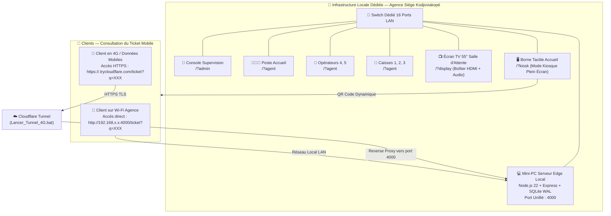
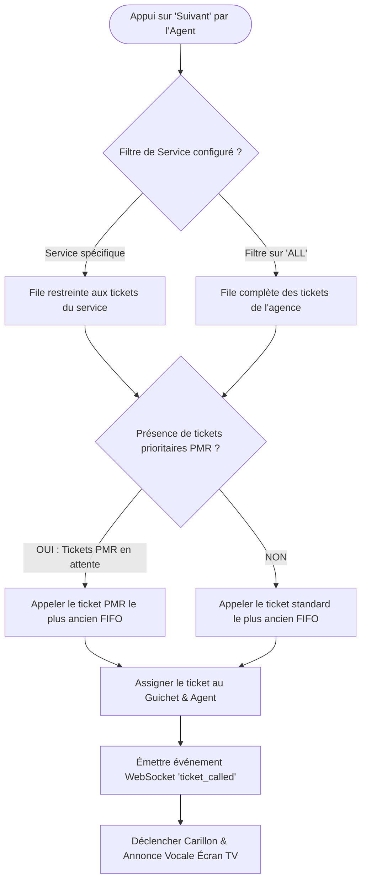
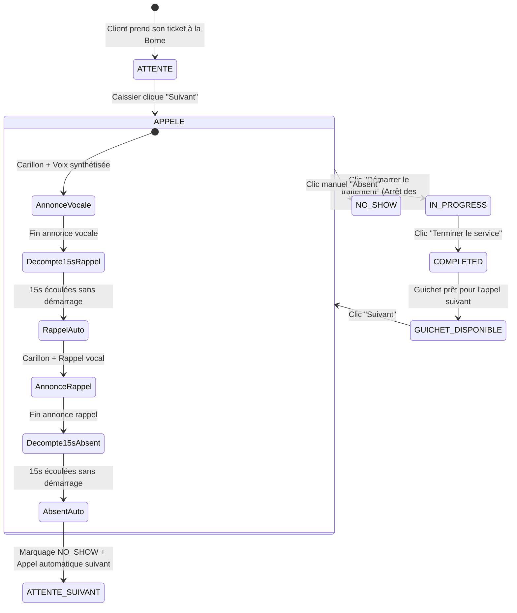

# 📘 COFINA QUEUE SYSTEM — Manuel & Architecture Technique (Serveur Edge & Passerelle 4G)

> **Client** : Groupe COFINA Togo (Microfinance — Agence Pilote Siège Kodjoviakopé & Réseau Agences)  
> **Auteur / Prestataire** : Matrix Industrie  
> **Architecture** : Serveur Edge Local 100% Autonome (Fonctionnement garanti Hors-Ligne) + Passerelle Publique 4G (Tunnel Cloudflare)  
> **Version** : 2.0 — Configuration Agence Réelle (6 Postes Dédiés, Routage Spécialisé, UI Plein Écran & Accès Hybride Wi-Fi/4G)

---

## 📋 SOMMAIRE

1. [Contexte Métier & Principes Directeurs](#1-contexte-métier--principes-directeurs)
2. [Topologie des Postes de l'Agence Siège (6 Guichets Dédiés)](#2-topologie-des-postes-de-lagence-siège-6-guichets-dédiés)
3. [Configuration & Routage des 12 Services par Poste](#3-configuration--routage-des-12-services-par-poste)
4. [Architecture Réseau Hybride (Edge LAN & Passerelle 4G)](#4-architecture-réseau-hybride-edge-lan--passerelle-4g)
5. [Description Détaillée des Modules Opérationnels](#5-description-détaillée-des-modules-opérationnels)
   - [5.1 🖥️ Borne Tactile d'Accueil (`KioskModule.jsx`)](#51-️-borne-tactile-daccueil-kioskmodulejsx)
   - [5.2 📺 Écran TV Public & Synthèse Vocale (`DisplayModule.jsx`)](#52--écran-tv-public--synthèse-vocale-displaymodulejsx)
   - [5.3 👨🏽‍💼 Station Agent Dédiée (`AgentModule.jsx`)](#53--station-agent-dédiée-agentmodulejsx)
   - [5.4 📱 Widget Bureau Flottant Indépendant (`FloatingTellerWidget.jsx`)](#54--widget-bureau-flottant-indépendant-floatingtellerwidgetjsx)
   - [5.5 🔐 Console Administration & Supervision (`AdminModule.jsx`)](#55--console-administration--supervision-adminmodulejsx)
   - [5.6 👤 Page Profil Agent & KPIs (`ProfilePage.jsx`)](#56--page-profil-agent--kpis-profilepagejsx)
6. [Algorithme d'Appel & Gestion des Files d'Attente](#6-algorithme-dappel--gestion-des-files-dattente)
7. [Cycle de Vie du Ticket Caissier & Automatisations](#7-cycle-de-vie-du-ticket-caissier--automatisations)
8. [Stratégie de Consolidation Multi-Agences & Reporting](#8-stratégie-de-consolidation-multi-agences--reporting)
9. [Sécurité, Sauvegardes & Résilience](#9-sécurité-sauvegardes--résilience)

---

## 1. Contexte Métier & Principes Directeurs

Le système est spécialement conçu pour le secteur de la microfinance en Afrique de l'Ouest (Lomé, Togo). Il prend en compte les contraintes d'infrastructures locales, notamment **les coupures fréquentes de connexion internet et les fluctuations électriques**.

### 🌟 Principes Clés
1. **Autonomie 100% Hors-Ligne en Agence** : L'ensemble des postes de travail physiques (Borne, Écran TV, Guichets Caisses, Opérateurs, Accueil, Supervision) fonctionne en réseau local interne (LAN / Switch dédié). **Aucune connexion internet n'est requise** pour le fonctionnement opérationnel de l'agence.
2. **Accès Hybride Wi-Fi & 4G pour le QR Code Client** :
   - Les clients peuvent scanner le QR Code de leur ticket avec leur smartphone en étant connectés au **Wi-Fi de l'agence** ou via leur **propre connexion mobile 4G/5G**.
   - Le système intègre un tunnel chiffré Cloudflare (`Lancer_Tunnel_4G.bat`) qui expose uniquement l'interface de consultation de ticket en HTTPS sécurisé, sans exposer la base de données.
3. **Ergonomie Hardware Épurée (Zéro Barre de Navigation en Production)** :
   - Tous les modules opérationnels s'ouvrent sans barre de navigation supérieure ni menu de démonstration pour éviter toute confusion ou fausse manipulation par les usagers et caissiers.
   - Un mode démonstration reste disponible via le paramètre URL `?demo=true` ou `?nav=true`.
4. **Un Collaborateur = Un Seul Poste de Travail Dédié** : Chaque agent physique est connecté sur sa propre machine / guichet. Il ne pilote qu'un guichet à la fois et ne visualise que les informations le concernant.
5. **Annonce Audio d'Appel au Guichet** :
   - *Sur la Borne* : Confirmation visuelle immédiate (sans synthèse vocale pour ne pas saturer l'accueil).
   - *Au Guichet & Écran TV* : Carillon Gong bi-tonal + Synthèse vocale de passage (*"Ticket D-008, veuillez passer à la Caisse 2"*).
6. **Impression Thermique 58mm × 50mm Format Paysage** :
   - Impression papier d'appoint calibrée pour **Xprinter 58mm USB** avec découpe papier native ESC/POS (`\x1DV\x41\x00`).
7. **Persistance SQLite WAL & Sauvegardes Atomiques** :
   - Persistance absolue en cas de délestage électrique. Sauvegarde quotidienne automatique via `VACUUM INTO` avec rétention de 14 jours.

---

## 2. Topologie des Postes de l'Agence Siège (6 Guichets Dédiés)

L'Agence Siège de Kodjoviakopé est organisée en **6 postes de travail physiques distincts**, répartis selon 3 métiers complémentaires :

| Numéro de Guichet | Désignation Métier | Profil Agent / Rôle | Type d'opérations principales |
| :---: | :--- | :--- | :--- |
| **Guichet 1** | **Caisse 1** | Caissier (Espèces & Transferts) | Dépôts, Retraits, Transferts, Versements |
| **Guichet 2** | **Caisse 2** | Caissier (Espèces & Transferts) | Dépôts, Retraits, Transferts, Versements |
| **Guichet 3** | **Caisse 3** | Caissier (Chèques & Opérations) | Remise de chèques, Dépôts/Retraits, Virements |
| **Guichet 4** | **Opérateur 1** | Chargé de Clientèle / Conseiller | Ouvertures de compte, Demandes de Crédit, SAV |
| **Guichet 5** | **Opérateur 2** | Conseiller Clientèle / Microfinance | Crédit, COFINA Mobile+, Conseils personnalisés |
| **Guichet 6** | **Accueil & Orientation** | Hôtesse d'Accueil / Chargé d'Information | Renseignements, Aide borne, Priorité PMR |

---

## 3. Configuration & Routage des 12 Services par Poste

Le système gère les **12 services officiels COFINA Togo**. Chaque poste de travail est configuré pour ne traiter que les services relevant de son pôle de compétence, grâce au **filtrage dynamique par service**.

### 3.1 Référentiel des 12 Services COFINA Togo

| Code | Libellé Officiel | Pôle Métier Assigné | Durée Moyenne | Icône Borne |
| :---: | :--- | :--- | :---: | :---: |
| **D** | Dépôt d'espèces | Caisses 1, 2, 3 | ~3 min | 💵 `Banknote` |
| **R** | Retrait d'espèces | Caisses 1, 2, 3 | ~3 min | 👛 `Wallet` |
| **TN** | Transfert national | Caisses 1, 2, 3 | ~5 min | 📤 `Send` |
| **TI** | Transfert international (Western Union, MoneyGram...) | Caisses 1, 2 | ~8 min | 🌐 `Globe` |
| **RC** | Remise de chèque | Caisse 3, Opérateurs | ~4 min | 📑 `FileCheck` |
| **V** | Virement bancaire | Caisse 3, Opérateurs | ~5 min | 🔄 `ArrowRightLeft` |
| **O** | Ouverture de compte | Opérateurs 1, 2 | ~15 min | 👤 `UserPlus` |
| **C** | Crédit & Demande de prêt | Opérateurs 1, 2 | ~20 min | 💳 `CreditCard` |
| **PC** | Parler à un conseiller | Opérateurs 1, 2 | ~15 min | 🎧 `Headphones` |
| **DR** | Demande de relevé bancaire | Opérateurs, Accueil | ~3 min | 📄 `FileText` |
| **CM** | COFINA Mobile+ & Digitalisation | Opérateurs, Accueil | ~5 min | 📱 `Smartphone` |
| **PMR** | Mobilité Réduite / Femmes Enceintes (Prioritaire) | Guichet 6 (Accueil & Orientation Dédié) | ~5 min | ♿ `Accessibility` |

### 3.2 Matrice de Routage & Flux Opérationnels

```
BORNE TACTILE (12 Services)
      │
      ├──▶ Flux Espèces & Monétique (D, R, TN, TI, RC, V) ────────▶ [Caisse 1, 2, 3]
      │
      ├──▶ Flux Conseil & Commercial (O, C, PC, CM, DR) ──────────▶ [Opérateur 1, 2]
      │
      └──▶ Flux Accueil, Renseignements & Vulnérabilité (PMR, Info) ─▶ [Poste Accueil]
```

---

## 4. Architecture Réseau Hybride (Edge LAN & Passerelle 4G)

Le système repose sur une architecture à double connectivité :
1. **Un réseau local LAN 100% autonome** pour l'agence (Switch dédié 16 ports).
2. **Une passerelle chiffrée optionnelle (Cloudflare Tunnel)** permettant l'accès mobile des clients en 4G.


```mermaid
graph TB
    subgraph LAN ["🏦 Infrastructure Locale Dédiée — Agence Siège Kodjoviakopé"]
        Switch[🔌 Switch Dédié 16 Ports LAN]

        MiniPC["💻 Mini-PC Serveur Edge Local\nNode.js 22 + Express + SQLite WAL\nPort Unifié : 4000"]
        
        Kiosk["🖥️ Borne Tactile Accueil\n/?kiosk (Mode Kiosque Plein Écran)"]
        DisplayTV["📺 Écran TV 55'' Salle d'Attente\n/?display (Boîtier HDMI + Audio)"]
        Caisses["🏧 Caisses 1, 2, 3\n/?agent"]
        Operateurs["💼 Opérateurs 4, 5\n/?agent"]
        Accueil["👩🏽‍💼 Poste Accueil\n/?agent"]
        Admin["🔐 Console Supervision\n/?admin"]

        Switch --- MiniPC
        Switch --- Kiosk
        Switch --- DisplayTV
        Switch --- Caisses
        Switch --- Operateurs
        Switch --- Accueil
        Switch --- Admin
    end

    subgraph CLIENTS ["📱 Clients — Consultation du Ticket Mobile"]
        ClientWifi["📶 Client sur Wi-Fi Agence\nAccès direct : http://192.168.x.x:4000/ticket?q=XXX"]
        Client4G["📱 Client en 4G / Données Mobiles\nAccès HTTPS : https://<tunnel>.trycloudflare.com/ticket?q=XXX"]
    end

    Kiosk -->|QR Code Dynamique| CLIENTS
    ClientWifi -->|Réseau Local LAN| MiniPC
    Client4G -->|HTTPS TLS| Cloudflare["☁️ Cloudflare Tunnel\n(Lancer_Tunnel_4G.bat)"]
    Cloudflare -->|Reverse Proxy vers port 4000| MiniPC
```

### URLs d'Accès par Type de Poste (Port unifié 4000)

| Équipement | URL Réseau Local | Mode d'Affichage | Script Windows |
| :--- | :--- | :--- | :--- |
| **Borne Tactile** | `http://<IP_SERVEUR>:4000/?kiosk` | Plein écran Kiosk tactile (sans navbar ni footer) | `Lancer_Borne_Cofina.bat` ou `ouvrir_borne.bat` |
| **Écran TV Salle d'Attente** | `http://<IP_SERVEUR>:4000/?display` | Plein écran public avec carillon & audio | `ouvrir_ecran_tv.bat` |
| **Postes Caissiers & Conseillers** | `http://<IP_SERVEUR>:4000/?agent` | Interface guichet épurée sans navbar | `ouvrir_caisse.bat` |
| **Widget Caissier Bureau** | `http://<IP_SERVEUR>:4000/?widgetOnly=true` | Fenêtre flottante compacte 360x420px | Intégré à l'interface agent |
| **Console Administration** | `http://<IP_SERVEUR>:4000/?admin` | Console de supervision sécurisée RBAC | `ouvrir_admin.bat` |
| **Mode Démonstration / Formation** | `http://<IP_SERVEUR>:4000/?demo=true` | Navigation complète visible avec sélecteur de modules | Accès manuel |
| **Health Check (Uptime Kuma)** | `http://<IP_SERVEUR>:4000/health` | Supervision JSON automatisée (200 UP) | N/A |
| **Informations Réseau & QR** | `http://<IP_SERVEUR>:4000/api/network-info` | Détection IP locale & statut passerelle 4G | N/A |

---

## 5. Description Détaillée des Modules Opérationnels

### 5.1 🖥️ Borne Tactile d'Accueil (`KioskModule.jsx`)
- **Grille de sélection des 12 services** avec icônes distinctes et codes couleurs COFINA Togo.
- **Accès Prioritaire 1-Clic PMR** : Détection des personnes à mobilité réduite, seniors et femmes enceintes avec attribution immédiate d'un ticket prioritaire `PMR-xxx`.
- **QR Code Adaptatif Automatique** :
  - Si la passerelle 4G est active (`PUBLIC_URL`), le QR Code encode l'URL HTTPS publique pour que le client puisse suivre son ticket en 4G.
  - Si le serveur fonctionne en LAN seul, le QR Code encode l'IP locale de l'agence.
  - Le libellé d'assistance s'adapte automatiquement : *« Scannez avec votre téléphone (Wi-Fi ou 4G) »*.
- **Impression thermique d'appoint** : Bouton d'impression Xprinter 58x50mm avec massicotage automatique ESC/POS (`\x1DV\x41\x00`).
- **Affichage immersif** : Absence complète de barre de navigation et de pied de page.

### 5.2 📺 Écran TV Public & Synthèse Vocale (`DisplayModule.jsx`)
- **Vue d'ensemble des 6 guichets en direct** : Caisses 1-3, Opérateurs 1-2, Accueil.
- **Bannière d'Appel Grand Format** : Numéro clignotant et mise en valeur du guichet de destination.
- **Sonorisation Bimodale Intelligente** :
  1. *Carillon Attention* : Sonnette 2 tons haute clarté.
  2. *Synthèse Vocale Web Speech API* : Annonce dynamique en français (*"Ticket D-015, veuillez passer à la Caisse 2"*).
- Plein écran total sans distractions visuelles.

### 5.3 👨🏽‍💼 Station Agent Dédiée (`AgentModule.jsx`)
- Session individuelle par agent avec guichet assigné.
- Bouton d'ouverture/fermeture de guichet (`🟢 Ouvert` / `🔴 Fermé`).
- **Commandes d'appel complètes** :
  - **Suivant (<kbd>▶</kbd>)** : Appelle le prochain client selon les services autorisés.
  - **Démarrer le traitement (<kbd>⏱</kbd>)** : Déclenche le chronomètre de service et interrompt immédiatement tous les minuteurs de rappel/absence.
  - **Rappeler (<kbd>🔄</kbd>)** : Relance l'annonce sonore et vocale à l'écran TV.
  - **Absent / No-Show (<kbd>👤❌</kbd>)** : Marque le ticket comme abandonné et appelle automatiquement le suivant.
  - **Terminer (<kbd>✔</kbd>)** : Clôture le ticket avec enregistrement des horodatages précis (`startedAt`, `completedAt`).
- Interface sans barre de navigation supérieure pour maximiser l'espace de travail.

### 5.4 📱 Widget Bureau Flottant Indépendant (`FloatingTellerWidget.jsx`)
- Fenêtre pop-out ultra-compacte (`360px x 420px`) détachable via le bouton (<kbd>↗</kbd>).
- Reste au premier plan pendant que le caissier utilise son logiciel bancaire (*Amplitude Core Banking*) ou *Excel*.
- Contient toutes les fonctionnalités d'appel sans perte de contexte.

### 5.5 🔐 Console Administration & Supervision (`AdminModule.jsx`)
- Accessible via `ouvrir_admin.bat` ou `http://<IP_SERVEUR>:4000/?admin`.
- Authentification stricte par JWT et contrôle de rôle `ADMIN`.
- Visualisation en temps réel des tickets du jour, des temps d'attente et des durées de traitement.
- Bouton de **Sauvegarde instantanée SQLite** et bouton d'**Archivage Hebdomadaire**.
- Bouton d'**Export CSV** pour le reporting DSI.

### 5.6 👤 Page Profil Agent & KPIs (`ProfilePage.jsx`)
- Profils agents personnalisés avec badges d'émulation (*Rapidité*, *Performance*, *Assiduité*).
- Métriques individuelles de la journée (clients servis, durée moyenne de traitement).

---

## 6. Algorithme d'Appel & Gestion des Files d'Attente

L'attribution du prochain ticket lors de l'appui sur **"Suivant"** (endpoint `/api/tickets/call-next`) obéit à la règle stricte suivante :


```mermaid
flowchart TD
    Start([Appui sur 'Suivant' par l'Agent]) --> CheckFilter{Filtre de Service configuré ?}
    
    CheckFilter -->|Service spécifique| FilteredQueue[File restreinte aux tickets du service]
    CheckFilter -->|Filtre sur 'ALL'| FullQueue[File complète des tickets de l'agence]
    
    FilteredQueue --> CheckPMR{Présence de tickets prioritaires PMR ?}
    FullQueue --> CheckPMR
    
    CheckPMR -->|OUI : Tickets PMR en attente| ServePMR[Appeler le ticket PMR le plus ancien FIFO]
    CheckPMR -->|NON| ServeStandard[Appeler le ticket standard le plus ancien FIFO]
    
    ServePMR --> AssignTicket[Assigner le ticket au Guichet & Agent]
    ServeStandard --> AssignTicket
    
    AssignTicket --> EmitWS[Émettre événement WebSocket 'ticket_called']
    EmitWS --> TriggerAudio[Déclencher Carillon & Annonce Vocale Écran TV]
```

1. **Priorité Absolue PMR** : Tout ticket portant le fanion de priorité est systématiquement appelé avant les tickets réguliers de la file.
2. **Ordre Chronologique FIFO** : Au sein d'une même catégorie de priorité, les clients sont servis selon l'ordre strict de création de leur ticket.
3. **Respect du Guichet Spécialisé** : Les guichets ne tirent que les tickets correspondant aux services qu'ils sont autorisés à traiter.

---

## 7. Cycle de Vie du Ticket Caissier & Automatisations

Le module caissier intègre un moteur d'automatisation des flux pour réduire les temps d'attente :


```mermaid
stateDiagram-v2
    [*] --> ATTENTE : Client prend son ticket à la Borne
    ATTENTE --> APPELE : Caissier clique "Suivant"
    
    state APPELE {
        [*] --> AnnonceVocale : Carillon + Voix synthétisée
        AnnonceVocale --> Decompte15sRappel : Fin annonce vocale
        Decompte15sRappel --> RappelAuto : 15s écoulées sans démarrage
        RappelAuto --> AnnonceRappel : Carillon + Rappel vocal
        AnnonceRappel --> Decompte15sAbsent : Fin annonce rappel
        Decompte15sAbsent --> AbsentAuto : 15s écoulées sans démarrage
    }

    APPELE --> IN_PROGRESS : Clic "Démarrer le traitement" (Arrêt des minuteurs)
    APPELE --> NO_SHOW : Clic manuel "Absent"
    
    IN_PROGRESS --> COMPLETED : Clic "Terminer le service"
    AbsentAuto --> ATTENTE_SUIVANT : Marquage NO_SHOW + Appel automatique suivant
    COMPLETED --> GUICHET_DISPONIBLE : Guichet prêt pour l'appel suivant
    GUICHET_DISPONIBLE --> APPELE : Clic "Suivant"
```

* **Détection de fin d'annonce vocale** : Les comptes à rebours ne démarrent qu'une fois la synthèse vocale terminée (`onend` avec fallback de 5,5s).
* **Rappel automatique (15s)** : Si le client ne s'est pas présenté au guichet après 15 secondes, un rappel sonore unique est émis.
* **Absence automatique & appel suivant (15s)** : Après 15 secondes supplémentaires sans démarrage de service, le ticket est automatiquement marqué `NO_SHOW` et le client suivant est appelé sans intervention manuelle.

---

## 8. Stratégie de Consolidation Multi-Agences & Reporting

### 8.1 Mode Déconnecté / Mensuel (Export CSV DSI)
- Depuis la console Administration, le Responsable d'Agence exporte les données au format CSV standardisé.
- Champs exportés : `ID Ticket`, `Numéro`, `Code Service`, `Nom Service`, `Prioritaire`, `Guichet`, `Agent`, `Créé Le`, `Appelé Le`, `Début Traitement`, `Terminé Le`, `Attente (min)`, `Traitement (min)`.
- Alimente les tableaux de bord décisionnels PowerBI / Metabase de la Direction Générale.

### 8.2 Mode Synchronisation Différée (`SyncOutbox`)
- Chaque événement métier (`TICKET_CREATED`, `TICKET_CALLED`, `TICKET_COMPLETED`, `WEEKLY_ARCHIVE`) est consigné dans la table locale `SyncOutbox`.
- Le worker d'arrière-plan expédie les événements par lots sécurisés vers le serveur central dès qu'une connexion réseau externe est établie.

---

## 9. Sécurité, Sauvegardes & Résilience

### 9.1 Contrôle d'Accès Sécurisé (RBAC) & Authentification
- Authentification stricte par **JWT (JSON Web Token)** sans aucun mécanisme de contournement.
- Rôle `AGENT` : réservé aux opérations de traitement des tickets.
- Rôle `ADMIN` : réservé à la supervision, à l'archivage et aux sauvegardes.
- Mots de passe et codes PIN hachés avec sel `bcryptjs` (salt rounds = 10).

### 9.2 Politique CORS Hybride & Sécurité du Tunnel 4G
- Les requêtes réseau local sont validées par une regex stricte sur les plages privées RFC 1918 :  
  `192.168.0.0/16`, `10.0.0.0/8`, `172.16.0.0/12`, et `localhost`.
- Les requêtes provenant du tunnel 4G sont filtrées par la liste blanche `*.trycloudflare.com` et l'URL explicite `PUBLIC_URL`.
- Le tunnel Cloudflare assure le **chiffrement HTTPS / TLS de bout en bout**. Aucune donnée de la file d'attente n'est persistée sur le cloud.

### 9.3 Sauvegarde Atomique SQLite (`VACUUM INTO`)
- Sauvegarde quotidienne programmée à minuit + déclenchement manuel en 1 clic dans l'Admin.
- Commande native `VACUUM INTO` garantissant une copie parfaite même en cours d'écriture (mode WAL).
- Conservation tournante des **14 derniers jours** dans `server/backups/`.

### 9.4 Résilience Électrique
- En cas de coupure brutale de courant, la base SQLite WAL préserve l'intégrité intégrale des données.
- Au redémarrage du Mini-PC, l'exécution de `Lancer_Borne_Cofina.bat` remet l'ensemble des postes en service en quelques secondes.

---

*© 2026 Groupe COFINA Togo — Documentation technique d'architecture et d'exploitation homologuée.*
