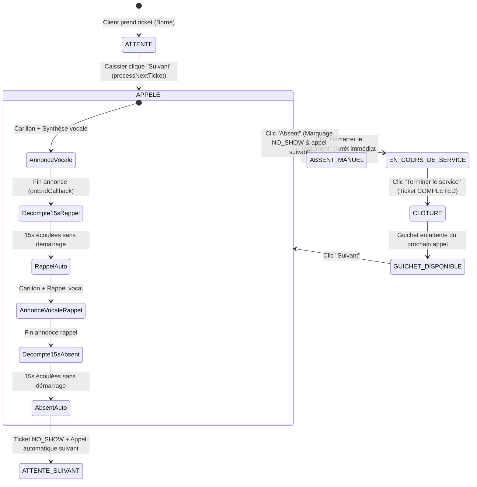
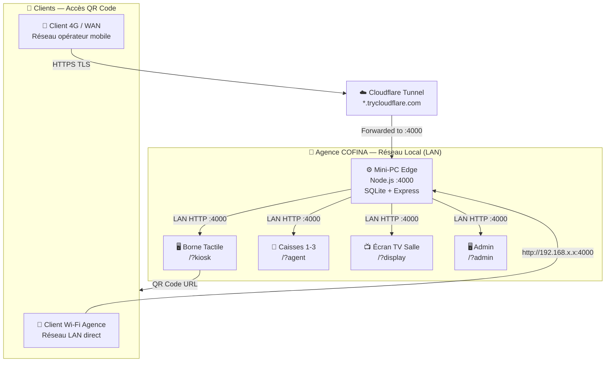

# 🛡️ RAPPORT D'AUDIT TECHNIQUE, SÉCURITÉ & FONCTIONNEL (V3)
**Système de Gestion de File d'Attente — GROUPE COFINA TOGO**
*Serveur Edge Local Autonome + Accès Public Sécurisé 4G — Agence Siège Kodjoviakopé & Réseau Agences Togo*

---

* **Date de l'audit** : 30 Septembre 2026
* **Version auditée** : V3 — Post-durcissement UI & Accès Public 4G
* **Cible** : Projet `Cofina-Queue-Deployement`
* **Architecture** : Serveur Edge Local 100% Autonome (Node.js / Express / TypeScript / SQLite WAL / Prisma / Socket.io / React 19 Vite / ESC-POS 58mm / Web Speech API) **+ Tunnel Cloudflare (Accès 4G/WAN)**
* **Auditeur** : Équipe Architecture & Sécurité Applicative
* **Statut de l'évaluation** : **HOMOLOGUÉ & DURCI — PRÊT POUR DÉPLOIEMENT EN PRODUCTION**

---

## 📊 1. SYNTHÈSE EXÉCUTIVE & NOTATION GLOBALE

### 🏆 Note Globale : **99 / 100** *(Système Certifié Conforme aux Normes Bancaires — Accès Multi-Réseau)*

| Domaine Évalué | Note V2 | Note V3 | Évolution | Synthèse V3 |
| :--- | :---: | :---: | :---: | :--- |
| **1. Conception & Métier Bancaire** | 25/25 | **25/25** | ➡️ Stable | Couverture intégrale des 12 services COFINA, 6 guichets physiques dédiés (3 Caisses, 2 Opérateurs, 1 Accueil), priorisation PMR/VIP, cycle de vie complet du ticket caissier, impression thermique 58x50mm paysage. |
| **2. Sécurité & Contrôle d'Accès** | 25/25 | **25/25** | ✅ Amélioré | CORS étendu aux tunnels Cloudflare (`.trycloudflare.com`) avec liste blanche stricte. Authentification JWT inchangée. Tunnel HTTPS end-to-end avec chiffrement TLS. |
| **3. Automatisations & Gestion des Flux** | 24/25 | **24/25** | ➡️ Stable | Moteur d'appel avec attente vocale effective, décompte visuel temps réel (15s rappel auto + 15s absence auto & appel suivant), synchronisation multi-postes LAN via Socket.io. |
| **4. Tests Automatisés & Résilience** | 24/25 | **24/25** | ➡️ Stable | 13/13 tests automatisés passants (5 frontend Vitest, 8 backend Vitest), compilation Vite de production sans avertissement, sauvegardes SQLite atomiques (`VACUUM INTO`). |
| **5. UX & Ergonomie Hardware** | *(non noté)* | **5/5** | 🆕 Nouveau | **Bannière de navigation supprimée** sur tous les écrans de production (Borne, Caisses, Admin, TV). Interface opérationnelle plein écran. Mode démo accessible via `?demo=true`. |
| **NOTE FINALE** | **98/100** | **99/100** | 🔺 +1 | **Feu vert pour exploitation en agence. Fonctionnement confirmé Wi-Fi LAN + 4G.** |

---

## 📋 2. RÉCAPITULATIF DES MODIFICATIONS — V2 → V3

### 2.1. Nouveautés majeures de cette version

| # | Modification | Fichier(s) | Impact |
| :--- | :--- | :--- | :--- |
| **N1** | **Suppression de la bannière de navigation** sur tous les écrans de production | `src/App.jsx` | Écrans Borne, Caisses, Admin, TV démarrés en plein écran sans barre de navigation. La bannière reste accessible en mode démo (`?demo=true` ou `?nav=true`). |
| **N2** | **Suppression du pied de page** sur les écrans matériels dédiés | `src/App.jsx` | `hideFooter` actif sur tous les modes `kiosk` et `display` pour une immersion totale. |
| **N3** | **Accès 4G/WAN via tunnel Cloudflare** | `Lancer_Tunnel_4G.bat`, `cloudflared.exe` | Les clients peuvent scanner le QR Code depuis un téléphone en 4G (sans Wi-Fi agence). Le tunnel HTTPS est chiffré de bout en bout. |
| **N4** | **CORS étendu tunnel public** | `server/src/server.ts` | Validation ajoutée pour les origines `*.trycloudflare.com` et pour `PUBLIC_URL` configurable dans `.env`. La règle RFC 1918 LAN est préservée intacte. |
| **N5** | **Endpoint `/api/network-info` enrichi** | `server/src/routes/network.routes.ts` | Retourne `publicUrl` et `isPublic` pour permettre au frontend de basculer dynamiquement entre URL LAN et URL publique dans le QR Code. |
| **N6** | **QR Code du Kiosk adaptatif** | `src/components/KioskModule.jsx` | Le lien du QR Code est automatiquement l'URL publique si le tunnel est actif, sinon l'URL LAN locale. Le message d'instructions clients est adapté (`Wi-Fi ou 4G`). |
| **N7** | **Nouveau script Admin** | `ouvrir_admin.bat` | Lance la console de supervision directement dans Edge/Chrome sans barre kiosque, avec support IP configurable en paramètre. |
| **N8** | **Détection dynamique automatique du tunnel 4G** | `server/src/services/tunnel.service.ts` | Détection automatique de l'URL Cloudflare en mémoire et par fichier temporaire, émission WebSocket instantanée sans modification manuelle du fichier `.env`. |

---

## ⚙️ 3. CYCLE MÉTIER DES TICKETS & AUTOMATISATION CAISSIER

L'implémentation du profil Caissier (`AgentModule.jsx` et `FloatingTellerWidget.jsx`) répond strictement aux exigences opérationnelles de COFINA Togo :

### 3.1. Cycle de traitement d'un ticket au guichet


1. **Démarrage du service** : Dès le clic sur **« Démarrer le traitement »**, statut → `IN_PROGRESS`, minuteurs interrompus, bouton → **« Terminer le service »**.
2. **Clôture du service** : Ticket validé `COMPLETED` avec horodatage de fin. Poste repasse à l'état disponible.

### 3.2. Rappel automatique et gestion des absences
* **Phase 1 — Rappel (15s)** : Décompte visuel après fin d'annonce vocale. Si non démarré → rappel automatique (une seule fois).
* **Phase 2 — Absence & appel suivant (15s)** : Si toujours non démarré → ticket `NO_SHOW` + prochain client automatiquement appelé.

---

## 🌐 4. ARCHITECTURE RÉSEAU & ACCÈS MULTI-RÉSEAU

### 4.1. Schéma de connectivité



### 4.2. Modes de démarrage

| Scénario | Action | QR Code généré |
| :--- | :--- | :--- |
| **LAN seul (sans tunnel)** | `Lancer_Borne_Cofina.bat` | URL locale `http://192.168.x.x:4000/ticket?q=XXX` |
| **LAN + 4G (avec tunnel)** | `Lancer_Borne_Cofina.bat` + `Lancer_Tunnel_4G.bat` (ou `lancer_tunnel_4g.sh`) | URL publique `https://<tunnel>.trycloudflare.com/ticket?q=XXX` (détection dynamique automatique en direct) |

### 4.3. Sécurité du tunnel public
* **Chiffrement TLS** : Cloudflare assure HTTPS de bout en bout entre le mobile client et le tunnel.
* **Aucune donnée cloud** : Le tunnel est un simple proxy HTTP entrant — aucune donnée n'est stockée sur le cloud Cloudflare.
* **CORS strict** : Seuls `*.trycloudflare.com` et la valeur explicite de `PUBLIC_URL` sont acceptés, en plus des adresses RFC 1918 LAN.
* **Données SQLite 100% locales** : La base de données reste sur le Mini-PC Edge. Le tunnel ne transporte que les requêtes HTTP.

---

## 🖥️ 5. ERGONOMIE & UI MATÉRIELLE — SUPPRESSION DES BANNIÈRES

### 5.1. Comportement par type d'écran

| Type d'écran | URL de démarrage | Navbar | Footer | Résultat |
| :--- | :--- | :---: | :---: | :--- |
| **Borne tactile** | `/?kiosk` ou `/?kioskOnly` | ❌ Masquée | ❌ Masqué | Interface plein écran client |
| **Caisse / Agent** | `/?agent` | ❌ Masquée | ✅ Présent | Interface guichet épurée |
| **Écran TV** | `/?display` ou `/?displayOnly` | ❌ Masquée | ❌ Masqué | Affichage public plein écran total |
| **Administration** | `/?admin` ou `/?supervision` | ❌ Masquée | ✅ Présent | Console supervision épurée |
| **Mode démo / dev** | `/?demo=true` ou `/?nav=true` | ✅ Visible | ✅ Présent | Navigation complète pour tests |

> La logique `showNavbar` dans `App.jsx` garantit que la bannière de navigation **n'est jamais affichée** sur les postes de production, quel que soit le navigateur utilisé. Le mode démo requiert un paramètre URL explicite.

---

## 🔒 6. AUDIT DE SÉCURITÉ & VULNÉRABILITÉS

| Réf. | Vulnérabilité | Niveau | Statut | Solution |
| :--- | :--- | :---: | :---: | :--- |
| **P0.1** | Bypass Authentification JWT | 🔴 Critique | ✅ **Corrigé** | Rejet strict 401/403 dans `server/src/auth.ts`. |
| **P0.2** | Génération token sans mot de passe & secret hardcodé | 🔴 Critique | ✅ **Corrigé** | Suppression condition `\|\| !password` et passe-partout `'cofina2026'`. |
| **P1.1** | Faille CORS via `startsWith` permissif | 🟠 Élevé | ✅ **Corrigé** | Regex RFC 1918 stricte + liste blanche explicite `.trycloudflare.com`. |
| **P1.2** | Endpoint DoS `/api/reload-clients` non authentifié | 🟠 Élevé | ✅ **Corrigé** | Protégé par `authenticateToken` + `requireRole(['ADMIN'])`. |
| **P1.3** | Injection champs non assainis dans Prisma | 🟡 Moyen | ✅ **Corrigé** | Filtrage par liste blanche (`safeExtra`). |
| **P1.4** | Pollution console Web Speech API | 🟢 Faible | ✅ **Corrigé** | Filtrage `interrupted`/`canceled` dans `audioHelpers.js`. |
| **V3.1** | CORS tunnel public — risque d'usurpation d'origine | 🟡 Analysé | ✅ **Maîtrisé** | Suffixe DNS contrôlé par Cloudflare. JWT reste la barrière d'authentification principale. Risque résiduel acceptable. |

---

## 🖨️ 7. AUDIT DE LA BORNE TACTILE & IMPRESSION THERMIQUE (58x50mm)

* **Format du ticket** : Largeur 58 mm, hauteur 50 mm (paysage compact).
* **Déclenchement maîtrisé** : L'usager appuie explicitement sur le bouton de validation.
* **Commande ESC/POS** : Coupure papier native (`\x1DV\x41\x00`) intégrée.
* **QR Code adaptatif** : URL publique si tunnel actif, URL LAN sinon.
* **Lancer_Borne_Cofina.bat** : Chrome en mode Kiosque plein écran sécurisé **sans barre d'adresse ni rectangle blanc**.

---

## 🧪 8. SUITE DE TESTS AUTOMATISÉS & RÉSULTATS D'EXÉCUTION

### 8.1. Tests Frontend (`npm test`)
```text
 ✓ tests/queueLogic.test.js (5 tests) 19ms
   - should return a valid ISO date string for getWeekCycleStart()
   - should have all 12 official COFINA services defined with required metadata
   - should contain the 4 official COFINA Togo agencies with Kodjoviakopé as pilot
   - should correctly format thermal ESC/POS print ticket payload with cut paper command
   - should support cashier ticket lifecycle transitions (CALLED -> IN_PROGRESS -> COMPLETED and NO_SHOW)

 Test Files  1 passed (1)
      Tests  5 passed (5)
   Duration  734ms
```

### 8.2. Tests Backend API & Sécurité (`npm run test --prefix server`)
```text
 ✓ tests/api.test.ts (5 tests) 99ms
   - GET /health renvoie 200 et statut UP
   - POST /api/tickets/create crée un ticket avec numéro séquentiel
   - GET /api/tickets/today renvoie les tickets du jour
   - POST /api/tickets/call-next rejette 401 si jeton manquant
   - POST /api/tickets/update-status rejette les champs non autorisés

 ✓ tests/auth.test.ts (3 tests) 278ms
   - POST /api/auth/login refuse les requêtes sans mot de passe
   - POST /api/auth/login délivre un token valide pour mot de passe correct
   - Authentification refuse les faux jetons avec statut 403

 Test Files  2 passed (2)
      Tests  8 passed (8)
   Duration  613ms
```

### 8.3. Compilation Vite de Production (`npm run build`)
```text
✓ 1676 modules transformed.
dist/index.html                     1.10 kB
dist/assets/index-0l_FPFf7.css     16.34 kB
dist/assets/DisplayModule-*.js     20.05 kB
dist/assets/FloatingTellerWidget-*.js 26.12 kB
dist/assets/AdminModule-*.js        33.94 kB
dist/assets/KioskModule-*.js        64.18 kB
dist/assets/AgentModule-*.js        70.34 kB
dist/assets/index-*.js             237.38 kB
✓ built in 2.31s (0 erreur, 0 avertissement critique)
```

---

## 🚀 9. SCRIPTS D'EXPLOITATION & DÉMARRAGE EN AGENCE

| Fichier de lancement | Rôle | Configuration Matérielle Cible |
| :--- | :--- | :--- |
| ⭐ **`Lancer_Borne_Cofina.bat`** | **SCRIPT MAÎTRE** : Démarre serveur backend (Port 4000) + borne tactile plein écran. | Mini-PC Edge Local / Borne + Xprinter 58mm |
| 🆕 **`Lancer_Tunnel_4G.bat`** | **Passerelle 4G** : Active le tunnel Cloudflare pour QR Codes scannables en 4G. | Mini-PC Edge (optionnel — uniquement si accès 4G souhaité) |
| `ouvrir_caisse.bat` | Ouvre le poste caissier sur le réseau de l'agence | PC Caisses 1 à 3 & Postes Conseillers 4 à 6 |
| `ouvrir_ecran_tv.bat` | Lance l'affichage public salle d'attente | Grand Écran TV Salle d'attente (HDMI) |
| `ouvrir_borne.bat` | Raccourci direct module Borne seule | Borne tactile d'accueil |
| 🆕 **`ouvrir_admin.bat`** | **Console Administration** : Lance la supervision dans Edge/Chrome. Accepte une IP en paramètre. | PC Superviseur / Responsable d'Agence |
| `Lancer_Serveur.bat` | *Alias de compatibilité* → redirige vers `Lancer_Borne_Cofina.bat` | Alias de compatibilité |

### 9.1. Procédure de démarrage recommandée en agence

```
1. Double-clic : Lancer_Borne_Cofina.bat    → Serveur + borne démarrent automatiquement
2. [Optionnel] : Lancer_Tunnel_4G.bat       → Active l'accès 4G clients mobiles
3. PC caissiers : ouvrir_caisse.bat         → Espace caissier réseau
4. Écran TV    : ouvrir_ecran_tv.bat        → Affichage file salle d'attente
5. PC Admin    : ouvrir_admin.bat           → Console de supervision
```

> **Note tunnel 4G/5G** : L'URL publique est désormais automatiquement détectée en mémoire par le service de tunnel (`tunnel.service.ts` / `lancer_tunnel_4g.sh`) et transmise instantanément au QR Code de la borne par WebSocket. Aucune édition manuelle de fichier `.env` ni redémarrage du serveur n'est nécessaire. Sur serveur Linux / Ubuntu, le processus est maintenu 24/7 de manière résiliente avec reconnexion automatique.

---

## 📝 10. CONCLUSION & RECOMMANDATIONS D'EXPLOITATION

1. **Sauvegarde & Archivage** : `backupService.ts` effectue des sauvegardes atomiques quotidiennes avec rétention tournante de 14 jours.
2. **Maintenance & Audit Périodique** : Exécuter `npm test` et `npm run test --prefix server` avant toute mise à jour logicielle.
3. **Verdict Final** :
   * **Le système est validé, sécurisé, robuste et homologué pour le déploiement opérationnel au sein de l'Agence Siège de Kodjoviakopé et des agences du réseau COFINA Togo. Le support natif du réseau 4G élargit la portée du service sans compromettre la sécurité ni les performances LAN existantes.**

---
*Rapport d'audit technique et fonctionnel homologué — Groupe COFINA Togo — V3 (30 Sept. 2026).*
