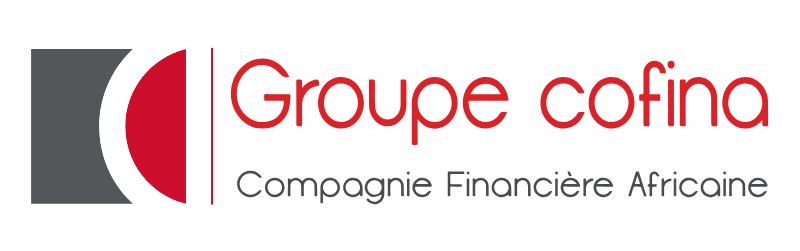

# 🏦 COFINA QUEUE SYSTEM V1 — Système de Gestion de File d'Attente Edge Local

<p align="center">
  
</p>

<p align="center">
  <b>Solution Haute-Disponibilité de Gestion de File d'Attente pour la Microfinance</b><br/>
  <i>Déployé pour le Groupe COFINA Togo (Agence Pilote Siège Kodjoviakopé & Agences de Lomé)</i>
</p>

<p align="center">
  
  
  
  
  
</p>

---

## 📌 CONTEXTE MÉTIER & ARCHITECTURE HORS-LIGNE

Le **Cofina Queue System V1** a été spécifiquement développé pour répondre aux réalités opérationnelles des agences de microfinance en Afrique de l'Ouest (Lomé, Togo). Il résout la contrainte majeure des **coupures fréquentes de connexion Internet** grâce à un **Serveur Edge Local 100% Autonome**.

### 🌟 Principes Directeurs
1. **0% Dépendance Cloud / Internet** : L'ensemble de la file d'attente (Borne tactile, Écran TV d'accueil, Postes Caissiers) fonctionne en **réseau local interne (LAN)**. Si la fibre ou la connexion 4G coupe, l'agence continue de servir les clients sans aucune interruption.
2. **Prise de Ticket 1-Clic "Zéro Barrière Digitale"** : Interface géante, intuitive et multilingue (Français / Anglais), adaptée aussi bien aux mamans commerçantes des marchés qu'aux clients institutionnels.
3. **Émission Hybride Duale** : 
   - **Ticket Papier Thermique ESC/POS** (imprimantes 80mm/58mm).
   - **Ticket Digital QR Code** scannable sur smartphone.
4. **Annonce Audio en 2 Temps** :
   - *Temps 1 (Borne)* : Vocalisation de confirmation immédiate à la prise de ticket (*"Bienvenue chez Cofina, votre ticket A-008 est créé..."*).
   - *Temps 2 (Guichet)* : Carillon Gong sonore + Annonce vocale de passage (*"Ticket A-008, veuillez passer à la Caisse 1"*).
5. **Persistance & Tolérance aux Pannes de Courant** : La base de données **SQLite locale** (`cofina_edge.db`) sauvegarde l'état de chaque ticket à la seconde près. En cas de délestage électrique, le système reprend exactement là où il s'était arrêté au redémarrage du serveur.

---

## 📐 ARCHITECTURE RÉSEAU LOCAL (LAN EDGE)

```mermaid
graph TD
    subgraph Réseau Local Intérieur de l'Agence (SANS INTERNET REQUIRED)
        Kiosk[🖥️ Borne Tactile Auto-Service] -->|Socket.io / HTTP Local| EdgeServer[💻 Serveur Edge Local Node.js / Express]
        Agent1[👨🏽‍💼 Poste Caisse 1] -->|Socket.io / HTTP Local| EdgeServer
        Agent2[👩🏽‍💼 Poste Caisse 2] -->|Socket.io / HTTP Local| EdgeServer
        Agent3[👨🏿‍💼 Poste Caisse 3] -->|Socket.io / HTTP Local| EdgeServer
        Agent4[👨🏽‍💼 Poste Caisse 4] -->|Socket.io / HTTP Local| EdgeServer
        Display[📺 Écran TV Salle d'Attente + Audio] <--|Socket.io Realtime| EdgeServer
        EdgeServer --> LocalDB[(🗄️ Base SQLite Locale Prisma)]
    end

    subgraph Supervision & Business Intelligence (Docker Local)
        EdgeServer -->|Health Check| UptimeKuma[💚 Supervision Uptime Kuma]
        LocalDB -->|Consolidation| Metabase[📊 Dashboard BI Metabase]
    end

    subgraph Data Analytics Groupe DG (Mensuel)
        LocalDB -->|Export CSV / Sync Différée| DataAnalyst[📈 Data Analyste — Bilan Direction]
    end
```

---

## 🚀 LES MODULES DU SYSTÈME

### 1. 🖥️ Borne Tactile Kiosque (`KioskModule.jsx`)
- Interface tactile grand format avec 4 boutons de services simplifiés :
  - **A** : Dépôt & Retrait d'Espèces *(Service N°1)*
  - **B** : Épargne & Tontine / Compte *(Service Épargne)*
  - **C** : Crédit & Microcrédit *(Service Financement)*
  - **V** : Service Client & Prioritaire *(VIP / Mamans Commerçantes)*
- Auto-réinitialisation dynamique après 15 secondes d'inactivité.
- Génération et découpe automatique ESC/POS sur imprimante thermique USB.

### 2. 📺 Écran TV Public & Annonces Vocales (`DisplayModule.jsx`)
- Grille dynamique d'affichage en direct des 4 Caisses (Caisse 1 à Caisse 4).
- Bannière d'appel clignotante avec animation visuelle d'urgence.
- Synthèse vocale Web Audio (`SpeechSynthesis`) et Carillon Gong bi-tonal.

### 3. 👨‍💼 Station Caissier / Guichet (`AgentModule.jsx` & `FloatingTellerWidget.jsx`)
- Sélection du caissier et affectation du numéro de guichet.
- Contrôle d'appel en 1-clic : **Suivant**, **Rappeler**, **Absent (No-Show)**.
- Chronomètre de traitement par client et suivi du délai moyen d'attente.
- Widget flottant réduisible accessible depuis n'importe quel écran.

### 4. 👤 Profils Agents & Administration (`ProfilePage.jsx` & `AdminModule.jsx`)
- Visualisation et édition des profils caissiers (Nom, Titre, Avatar emoji / photo).
- Attribution automatique de **Badges d'Excellence** (*Rapide*, *Performant*, *Senior*, *Fiable*).
- Historique détaillé de la journée et **Export CSV sécurisé** pour le Data Analyste.

---

## 📦 STRUCTURE DU PROJET

```
Cofina/
├── 📄 DEPLOIEMENT.md             # Guide de déploiement en production pas à pas
├── 📄 DOCUMENTATION_TECHNIQUE.md # Architecture technique et spécifications
├── 📄 README.md                  # Présentation générale du système
├── 📄 deploy.sh                  # Script de déploiement automatisé (Linux / Mac)
├── 📄 deploy.bat                  # Script de déploiement automatisé (Windows)
├── 📄 docker-compose.yml         # Stack PostgreSQL, Metabase BI et Uptime Kuma
├── 📄 ecosystem.config.js        # Configuration de démarrage PM2 Process Manager
├── 📄 package.json               # Dépendances Frontend React
├── 📄 vite.config.js             # Configuration du bundler Vite
│
├── 📁 server/                    # SERVEUR BACKEND NODE.JS EDGE
│   ├── 📄 package.json           # Dépendances Backend (Express, Socket.io, Prisma)
│   ├── 📁 prisma/
│   │   ├── 📄 schema.prisma      # Schéma de base de données SQLite/PostgreSQL
│   │   └── 📄 seed.js            # Données d'initialisation d'agence
│   └── 📁 src/
│       └── 📄 server.ts          # Serveur Express, WebSocket & REST API
│
└── 📁 src/                       # APPLICATION FRONTEND REACT
    ├── 📄 App.jsx                # Application principale & Routeur de modules
    ├── 📁 components/
    │   ├── 📄 KioskModule.jsx    # Borne tactile
    │   ├── 📄 DisplayModule.jsx  # Écran TV Public & Synthèse vocale
    │   ├── 📄 AgentModule.jsx    # Poste de travail Caissier
    │   ├── 📄 AdminModule.jsx    # Administration & Statistiques
    │   ├── 📄 ProfilePage.jsx    # Profil Caissier & Badges
    │   └── 📄 Navbar.jsx         # Barre de navigation & Sélecteur de langue
    └── 📁 services/
        ├── 📄 queueStore.js      # Moteur de synchronisation Socket.io + LocalStorage
        └── 📄 translations.js   # Dictionnaire de traduction FR / EN
```

---

## ⚡ DÉMARRAGE RAPIDE (MODE DÉVELOPPEMENT)

### 1. Cloner et installer les dépendances
```bash
git clone <URL_DU_DEPOT> Cofina
cd Cofina

# Installer les dépendances Frontend & Backend
npm install
npm --prefix server install
```

### 2. Initialiser la base SQLite locale
```bash
npm --prefix server run prisma:generate
npm --prefix server run prisma:push
```

### 3. Lancer le serveur et le frontend en mode dev
```bash
# Terminal 1 : Serveur Backend Node.js
npm run server:dev

# Terminal 2 : Frontend React Vite
npm run dev
```

L'application sera accessible sur :
- **Frontend** : `http://localhost:3000`
- **Backend API & Socket.io** : `http://localhost:4000`
- **Health Check** : `http://localhost:4000/health`

---

## 🚀 DÉPLOIEMENT AUTOMATISÉ EN AGENCE (1-CLIC)

Pour déployer le système sur le serveur Edge d'une agence en production :

### Sur Linux / Ubuntu Server :
```bash
chmod +x deploy.sh
./deploy.sh
```

### Sur Windows Server / Windows 10-11 :
Double-cliquez sur **`deploy.bat`** ou exécutez `deploy.bat` dans l'invite de commande.

> Pour tous les détails de configuration du réseau LAN d'agence et des navigateurs en mode Kiosque, consultez le guide [DEPLOIEMENT.md](file:///d:/Cofina/DEPLOIEMENT.md).

---

## 🛠️ ENDPOINTS API REST & SOCKET.IO

### REST API Endpoints (`http://localhost:4000`)
- `GET /health` : État du serveur et nombre de tickets actifs pour Uptime Kuma.
- `GET /api/tickets` : Récupère la liste des tickets du jour et les compteurs par service.
- `POST /api/tickets/create` : Crée un nouveau ticket depuis la borne.
- `POST /api/tickets/call-next` : Appelle le ticket suivant pour un caissier (priorité gérée automatiquement).
- `POST /api/tickets/update-status` : Met à jour le statut (`IN_PROGRESS`, `COMPLETED`, `NO_SHOW`, `CANCELLED`).
- `POST /api/tickets/recall` : Rappelle le ticket courant sur l'écran TV.
- `POST /api/auth/login` : Authentification sécurisée des caissiers par JWT.

### Événements WebSocket (`Socket.io LAN`)
- `init_state` : État initial diffusé à la connexion d'un écran.
- `ticket_created` : Émis lors de la création d'un ticket sur la borne.
- `ticket_called` : Émis lorsqu'un caissier appelle un ticket.
- `ticket_updated` : Émis lors du changement d'état d'un ticket.
- `ticket_recalled` : Émis lors d'un rappel sonore de ticket.

---

## 📄 LICENCE & CRÉDITS

- **Client** : Groupe COFINA Togo (Compagnie Financière Africaine)
- **Auteur / Prestataire** : Matrix Industrie
- **Projet** : Cofina Queue System V1 Edge

*© 2026 Groupe COFINA — Tous droits réservés.*
