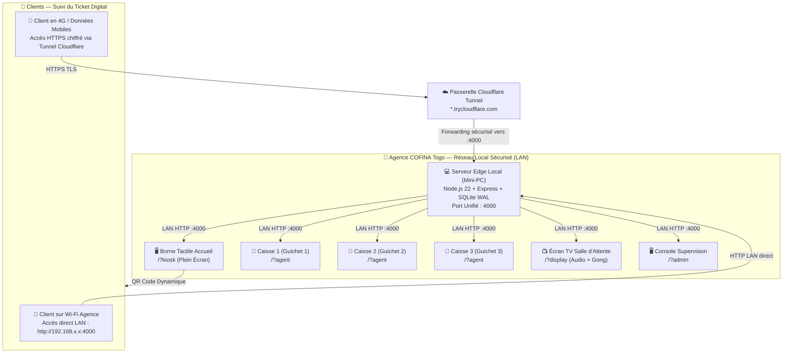

# 🏦 COFINA QUEUE SYSTEM V2 — Système de Gestion de File d'Attente Edge Local & 4G

<p align="center">
  
</p>

<p align="center">
  <b>Solution Haute-Disponibilité de Gestion de File d'Attente pour la Microfinance</b><br/>
  <i>Déployé pour le Groupe COFINA Togo (Agence Pilote Siège Kodjoviakopé & Réseau Agences)</i>
</p>

<p align="center">
  
  
  
  
  
  
</p>

---

## 📌 CONTEXTE MÉTIER & PRINCIPES DIRECTEURS

Le **Cofina Queue System** a été conçu pour répondre aux exigences réelles des agences bancaires et de microfinance en Afrique de l'Ouest (Lomé, Togo). Il associe la robustesse d'un **serveur Edge local 100% autonome** à la flexibilité d'une **passerelle mobile 4G sécurisée**.

### 🌟 Principes Clés

1. **0% Dépendance Cloud pour l'Agence (Hors-Ligne Garanti)** :
   - L'ensemble des postes de travail de l'agence (Borne tactile, Caisses, Écran TV, Administration) fonctionne exclusivement en **réseau local (LAN)** sur le port unifié **4000**.
   - Même en cas de coupure totale d'Internet ou de fibre, l'agence fonctionne normalement sans interruption.

2. **Accès Hybride Wi-Fi & 4G/5G pour le QR Code Client** :
   - Les clients peuvent scanner le QR Code de leur ticket depuis leur smartphone, **qu'ils soient connectés au Wi-Fi de l'agence ou en données mobiles 4G/5G**.
   - Le QR Code bénéficie d'un contraste maximal (Noir pur `#000000` sur Fond Blanc `#ffffff`, marge 2, correction d'erreur M) et est directement cliquable sur écran pour tests.
   - Détection dynamique automatique de l'URL publique Cloudflare (`tunnel.service.ts` / `lancer_tunnel_4g.sh`) sans aucune reconfiguration manuelle de fichier `.env`.

3. **Interface Hardware Épurée & Déconnexion Sécurisée** :
   - Les écrans opérationnels (Borne tactile, Guichets caissiers, Écran TV, Console superviseur) se lancent en **plein écran immersif sans barre de navigation ni menu de démo**.
   - Déconnexion 1-clic intégrée pour les caissiers avec nettoyage instantané de tous les minuteurs d'appel (`clearAllAutoTimers`).
   - Un mode démo reste accessible aux administrateurs et formateurs via le paramètre URL `?demo=true` ou `?nav=true`.

4. **Automatisation Métier Complète & File Audio FIFO Séquentielle** :
   - File d'attente audio stricte FIFO (`audioQueueRef`) sur l'écran TV : aucun chevauchement de voix en cas d'appels simultanés multi-caisses.
   - Synchronisation vocale intelligente : le système attend la fin effective de l'annonce vocale avant de lancer les minuteurs.
   - **Rappel automatique (15s)** si le client ne s'est pas présenté au guichet.
   - **Absence automatique & appel du client suivant (15s)** sans manipulation manuelle requise du caissier.
   - Transition fluide : *Appelé* $\rightarrow$ *En cours de service* $\rightarrow$ *Terminé* ou *Absent (No-Show)*.

5. **Impression Thermique 44mm Calibrée sur Rouleau 58mm** :
   - Impression calibrée pour imprimante **Xprinter 58mm USB** (largeur imprimable effective de 44mm, marges nulles, zéro coupure sur les tickets PMR ou chèques).
   - Impression via un iframe HTML isolé invisible (aucune fenêtre grise ou page parasite).
   - Commande native de découpe papier ESC/POS (`\x1DV\x41\x00`).

6. **Persistance SQLite WAL & Sauvegardes Atomiques Quotidiennes** :
   - Base de données locale ultra-rapide en mode Write-Ahead Logging (`WAL`).
   - Sauvegardes automatiques quotidiennes à minuit via `VACUUM INTO` sans blocage de service, avec rétention tournante de 14 jours.

---

## 📐 ARCHITECTURE RÉSEAU HYBRIDE (LAN + TUNNEL 4G)


```mermaid
graph TB
    subgraph AGENCE ["🏦 Agence COFINA Togo — Réseau Local Sécurisé (LAN)"]
        EDGE["💻 Serveur Edge Local (Mini-PC)\nNode.js 22 + Express + SQLite WAL\nPort Unifié : 4000"]
        BORNE["🖥️ Borne Tactile Accueil\n/?kiosk (Plein Écran)"]
        CAISSE1["🏧 Caisse 1 (Guichet 1)\n/?agent"]
        CAISSE2["🏧 Caisse 2 (Guichet 2)\n/?agent"]
        CAISSE3["🏧 Caisse 3 (Guichet 3)\n/?agent"]
        TV["📺 Écran TV Salle d'Attente\n/?display (Audio + Gong)"]
        ADMIN["🖥️ Console Supervision\n/?admin"]
    end

    subgraph CLIENTS ["📱 Clients — Suivi du Ticket Digital"]
        WIFI["📶 Client sur Wi-Fi Agence\nAccès direct LAN : http://192.168.x.x:4000"]
        MOBILE["📱 Client en 4G / Données Mobiles\nAccès HTTPS chiffré via Tunnel Cloudflare"]
    end

    EDGE -->|LAN HTTP :4000| BORNE
    EDGE -->|LAN HTTP :4000| CAISSE1
    EDGE -->|LAN HTTP :4000| CAISSE2
    EDGE -->|LAN HTTP :4000| CAISSE3
    EDGE -->|LAN HTTP :4000| TV
    EDGE -->|LAN HTTP :4000| ADMIN

    BORNE -->|QR Code Dynamique| CLIENTS
    WIFI -->|HTTP LAN direct| EDGE
    MOBILE -->|HTTPS TLS| CF["☁️ Passerelle Cloudflare Tunnel\n*.trycloudflare.com"]
    CF -->|Forwarding sécurisé vers :4000| EDGE
```

---

## 🚀 LES MODULES DU SYSTÈME

### 1. 🖥️ Borne Tactile Kiosque (`KioskModule.jsx`)
- **12 Services Officiels COFINA Togo** avec icônes distinctes et codes couleurs :
  - **D** : Dépôt d'espèces | **R** : Retrait d'espèces | **TN** : Transfert national | **TI** : Transfert international
  - **O** : Ouverture de compte | **RC** : Remise de chèque | **V** : Virement bancaire | **DR** : Demande de relevé
  - **CM** : COFINA Mobile+ | **C** : Crédit / Prêt | **PC** : Parler à un conseiller | **PMR** : Mobilité réduite (Prioritaire)
- **QR Code Adaptatif Automatique** : génère dynamiquement l'URL publique 4G si le tunnel est actif, ou l'URL locale LAN si seul le Wi-Fi est utilisé.
- **Impression thermique d'appoint** : bouton d'impression Xprinter 58x50mm paysage avec massicot automatique.
- **Affichage plein écran épuré** : aucune barre de navigation ni pied de page distrayant pour l'usager.

### 2. 📺 Écran TV Salle d'Attente (`DisplayModule.jsx`)
- Affichage temps réel de l'état des 6 guichets (3 Caisses, 2 Opérateurs, 1 Accueil).
- Animation d'appel dynamique grand format avec numéro clignotant.
- **Sonorisation binationale** : Carillon attention bi-tonal + Synthèse vocale de passage (*"Ticket D-008, veuillez passer à la Caisse 1"*).
- Mode plein écran TV sans barre d'adresse ni navbar.

### 3. 👨🏽‍💼 Station Agent & Caissier (`AgentModule.jsx` & `FloatingTellerWidget.jsx`)
- Session individuelle par guichet avec statut `🟢 Ouvert` / `🔴 Fermé`.
- Commandes d'appel complètes : **Suivant**, **Démarrer le traitement**, **Rappeler**, **Absent (No-Show)**, **Terminer**.
- Décompte visuel temps réel des minuteurs (15s rappel auto $\rightarrow$ 15s absence auto & appel suivant).
- **Widget Bureau Indépendant (<kbd>↗</kbd>)** : mini-fenêtre flottante (`360px x 420px`) détachable pour opérer tout en travaillant sur le progiciel bancaire (*Amplitude Core Banking* ou *Excel*).

### 4. 🔐 Console d'Administration & Supervision (`AdminModule.jsx`)
- Vue d'ensemble des flux du jour, des temps d'attente et du traitement par guichet.
- Gestion des utilisateurs et profils agents avec attribution de badges d'excellence.
- Déclenchement manuel de sauvegarde SQLite et archivage hebdomadaire.
- Export CSV sécurisé pour le reporting et l'analytique DSI.

---

## 📁 STRUCTURE DU PROJET

```
Cofina-Queue-Deployement/
├── 📄 Lancer_Borne_Cofina.bat     # ⭐ Script MAÎTRE Windows : Démarre Serveur Edge (4000) + Borne Kiosk
├── 📄 Lancer_Tunnel_4G.bat        # 🌐 Passerelle 4G Cloudflare Windows
├── 📄 lancer_tunnel_4g.sh         # 🐧 Passerelle 4G Cloudflare Linux/Ubuntu (sans sudo, résilience 24/7)
├── 📄 install_ubuntu.sh           # 🐧 Script d'installation automatique pour serveur Ubuntu
├── 📄 ecosystem.config.cjs        # ⚙️ Configuration PM2 de production (Edge Server + Tunnel 4G)
├── 📄 ouvrir_agent.bat            # 💼 Lance le poste Agent / Guichet sur le réseau local (/?agent)
├── 📄 ouvrir_caisse.bat           # 🏧 Alias pour ouvrir le poste Caissier / Guichet (/?agent)
├── 📄 ouvrir_ecran_tv.bat         # 📺 Lance l'affichage TV salle d'attente
├── 📄 ouvrir_borne.bat            # 🖥️ Raccourci vers la borne tactile seule
├── 📄 ouvrir_admin.bat            # 🔐 Lance la console d'administration et supervision
├── 📄 Lancer_Serveur.bat          # 🔄 Alias de compatibilité vers Lancer_Borne_Cofina.bat
├── 📄 RAPPORT_AUDIT.md            # 🛡️ Rapport d'audit technique, sécurité et fonctionnel (V3.1)
├── 📄 DEPLOIEMENT.md              # 📖 Guide de déploiement pas à pas (Windows / Ubuntu)
├── 📄 DOCUMENTATION_TECHNIQUE.md  # 📘 Manuel technique complet et matrice de routage
├── 📄 cloudflared.exe             # Binaire officiel Cloudflare Tunnel (Windows)
│
├── 📁 server/                     # BACKEND EXPRESS / TYPESCRIPT / SQLITE
│   ├── 📁 prisma/                 # Schéma Prisma SQLite (Ticket, User, Archive, SyncOutbox)
│   ├── 📁 dist/                   # 🚀 Build serveur précompilé (déploiement instantané sans build distant)
│   ├── 📁 src/
│   │   ├── 📄 server.ts           # Serveur Express, CORS RFC 1918 + Cloudflare, Socket.io
│   │   ├── 📄 auth.ts             # Middleware JWT & RBAC strict
│   │   ├── 📁 routes/             # Routes REST (/tickets, /auth, /network-info, /backup...)
│   │   └── 📁 services/           # Sauvegarde SQLite (VACUUM INTO) & Tunnel dynamique 4G
│   └── 📄 package.json
│
├── 📁 dist/                       # 🚀 Build frontend Vite précompilé (zéro build nécessaire sur le serveur)
└── 📁 src/                        # FRONTEND REACT 19 / VITE / TAILWIND
    ├── 📄 App.jsx                 # Routeur avec masquage navbar/footer automatique
    ├── 📁 components/             # KioskModule, DisplayModule, AgentModule, AdminModule...
    └── 📁 services/               # Client API, WebSocket, helpers d'impression ESC/POS & audio
```

---

## ⚡ SCRIPTS D'EXPLOITATION EN AGENCE (WINDOWS)

Pour une utilisation simple au quotidien par les équipes de l'agence, des raccourcis Windows `.bat` préconfigurés sont disponibles à la racine :

| Script | Rôle | Machine Cible |
| :--- | :--- | :--- |
| ⭐ **`Lancer_Borne_Cofina.bat`** | **Script MAÎTRE tout-en-un** : Détecte et lance automatiquement le serveur backend (Port 4000) puis ouvre la borne tactile en plein écran Kiosk sans barre d'adresse. | Mini-PC Serveur Edge de l'agence |
| 🌐 **`Lancer_Tunnel_4G.bat`** | **Passerelle 4G** : Active le tunnel Cloudflare pour rendre le QR code scannable par les clients en 4G. | Mini-PC Serveur Edge (optionnel) |
| 💼 **`ouvrir_agent.bat`** | Ouvre l'espace de travail agent (Caisse, Conseil, Accueil) sur le poste. | Postes Guichets 1 à 6 (Caisses, Conseillers, Accueil) |
| 🏧 **`ouvrir_caisse.bat`** | Alias vers `ouvrir_agent.bat` (ouvre le poste en mode application). | Postes Guichets 1 à 6 (Caisses, Conseillers, Accueil) |
| 📺 **`ouvrir_ecran_tv.bat`** | Lance l'affichage public de la salle d'attente avec audio. | Écran TV Salle d'attente (HDMI) |
| 🖥️ **`ouvrir_borne.bat`** | Ouvre uniquement l'interface de la borne tactile. | Borne tactile d'accueil |
| 🔐 **`ouvrir_admin.bat`** | Ouvre la console d'administration et de supervision. | PC Superviseur / Responsable d'agence |

---

## 🐧 DÉPLOIEMENT INSTANTANÉ SUR SERVEUR UBUNTU (LINUX)

Les artefacts de production (`dist/` et `server/dist/`) étant **déjà compilés et versionnés dans Git**, aucune étape de build n'est nécessaire sur le serveur distant.

```bash
# Mise à jour et redémarrage en 1 commande :
cd /opt/cofina-queue && git pull origin main && pm2 restart all
```

Pour la gestion 24/7 des processus avec PM2 :
```bash
pm2 start ecosystem.config.cjs
pm2 save
```

---

## 🌐 URLs D'ACCÈS PAR TYPE DE POSTE

En production, **l'ensemble du système est unifié sur le port 4000** :

| Écran | URL Réseau Local | Mode d'Affichage |
| :--- | :--- | :--- |
| **Borne Tactile Kiosque** | `http://<IP_SERVEUR>:4000/?kiosk` | Plein écran tactile épuré (sans navbar ni footer) |
| **Écran TV Salle d'Attente** | `http://<IP_SERVEUR>:4000/?display` | Plein écran public avec carillon & audio séquentiel FIFO |
| **Poste Caissier / Conseiller** | `http://<IP_SERVEUR>:4000/?agent` | Interface guichet sans navbar avec déconnexion 1-clic |
| **Console Administration** | `http://<IP_SERVEUR>:4000/?admin` | Console de supervision sécurisée par JWT |
| **Widget Caissier Bureau** | `http://<IP_SERVEUR>:4000/?widgetOnly=true` | Fenêtre pop-out détachable compacte |
| **Mode Démonstration / Tests** | `http://<IP_SERVEUR>:4000/?demo=true` | Interface avec barre de navigation visible |
| **Health Check Serveur** | `http://<IP_SERVEUR>:4000/health` | Vérification santé JSON (statut UP) |
| **Informations Réseau & QR** | `http://<IP_SERVEUR>:4000/api/network-info` | Détection IP locale & URL publique 4G dynamique |
| **Suivi Mobile Client** | `http://<IP_SERVEUR>:4000/api/tickets/track/:ticketNumber` | Consultation temps réel du statut d'un ticket (Public) |

---

## 🧪 TESTS AUTOMATISÉS & VALIDATION

Le projet dispose d'une suite complète de tests unitaires et d'intégration couvrant le frontend et le backend :

```bash
# Tests Frontend (Logique Métier, ESC/POS, Cycle Ticket, Services COFINA)
npm test

# Tests Backend (API REST, Authentification JWT, Sécurité RBAC)
npm run test --prefix server

# Compilation de production Vite
npm run build
```

**Résultats de validation :**
- Frontend : 5/5 tests passants (Vitest)
- Backend : 8/8 tests passants (Vitest)
- Compilation de production : 0 erreur, 0 avertissement critique

---

## 📄 LICENCE & CRÉDITS

- **Client** : Groupe COFINA Togo (Compagnie Financière Africaine)
- **Agence Pilote** : Agence Siège de Kodjoviakopé, Lomé
- **Développement & Homologation** : Équipe Architecture & Sécurité Applicative

*© 2026 Groupe COFINA — Tous droits réservés.*
